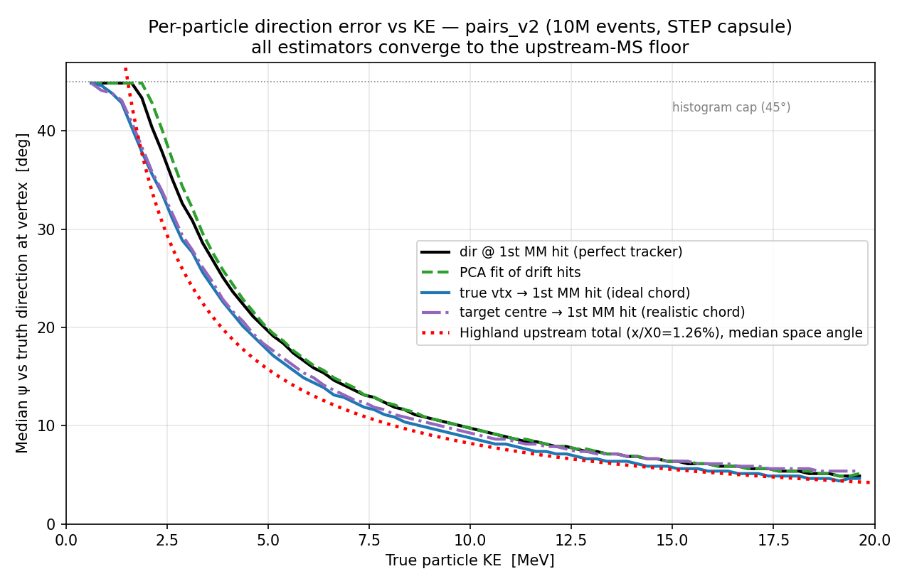
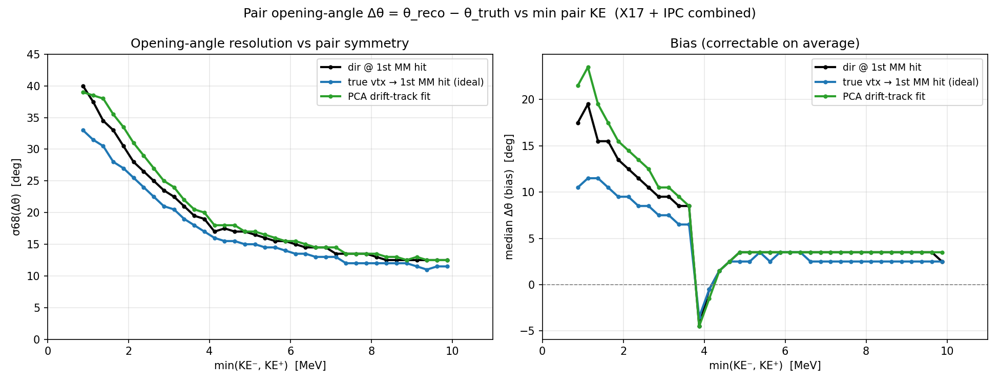
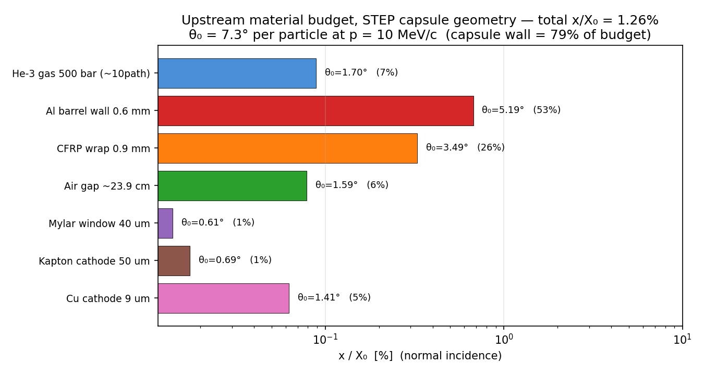
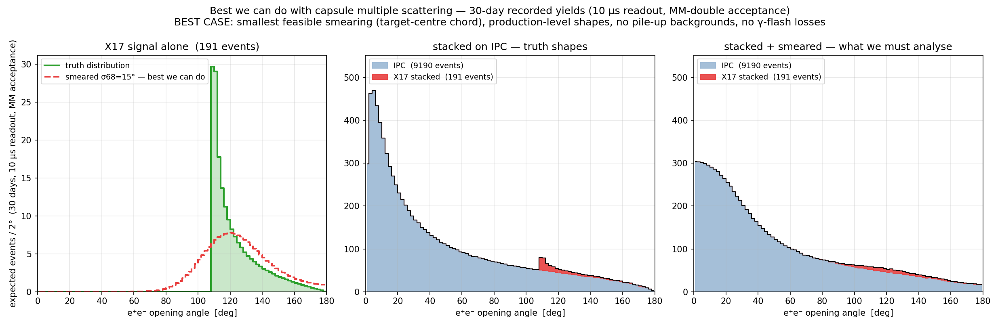
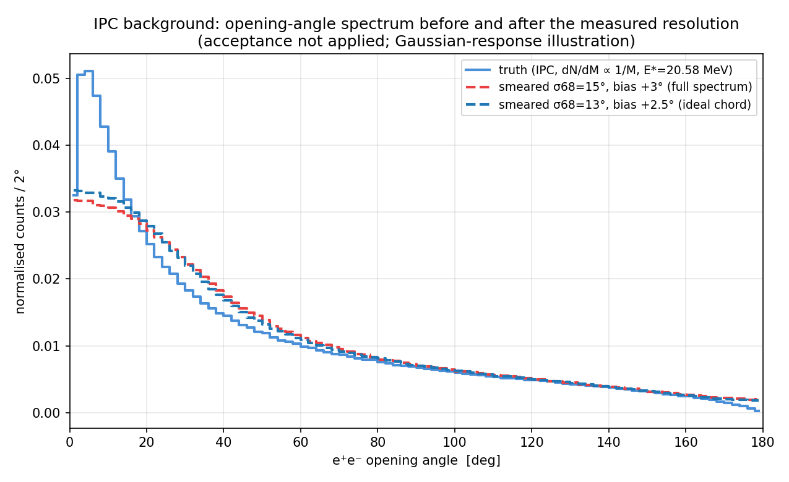
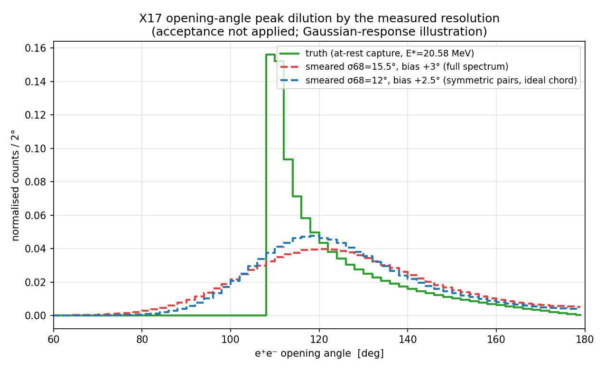

# Opening-angle resolution of the MX17 pair spectrometer — algorithm survey and hard limits

> **This is the working markdown version.** The formal write-up (with the
> geometry/scattering diagrams) is `docs/report/angular_note.pdf`
> (`angular_note.tex`, figures from `scripts/make_angular_report_figures.py`).

**Dylan Neff — 2026-06-12** &nbsp;|&nbsp; drafted by Claude (Fable 5), reviewed by D. Neff
**Data:** 10⁷ at-rest X17+IPC pair events, STEP small-capsule geometry (`pairs_v2`, 2026-06-12)
**Scope:** Micromegas (MM) tracking only — calorimetry assumed saturated/unusable for the high-energy measurement.

---

## Part I — Executive summary

**The number:** the best opening-angle resolution any reconstruction can reach with
the current hardware is **σ68(Δθ) ≈ 14.5°** over the full accepted X17 spectrum,
**≈ 11.5–12.5° for the most symmetric pairs** — and that already assumes the vertex
is known *exactly* (oracle). The realistic versions (target-centre vertex
constraint, PCA track fit) sit only 0.5–1.5° above the oracle. **All seven
reconstruction methods tried land within 2° of each other.** There is no
algorithmic headroom left worth chasing.

**Why:** the resolution is set by multiple scattering in the **capsule wall**
(0.6 mm Al + 0.9 mm CFRP = **79 %** of the 1.26 % X₀ upstream budget), ~11 mm
from the vertex. A scatter that close to the origin rotates the whole visible
track; every downstream measurement — including a chord drawn from the true
vertex — retains ≈ 96 % of the scattering angle (see Part II §5). No tracking
upgrade, vertex constraint, or fit cleverness can undo it.

**The vertex trick (your specific question):** yes, it's implemented
(`nomline` = target centre → first MM hit), and with the new small capsule it is
already **within 0.5° of the perfect-vertex limit**. The small target closed
that gap: assuming the capsule centre costs only ~3° per particle *in
quadrature* against an 8–10° MS floor. Two-track vertexing can't beat it —
individual tracks point back to the vertex with a median miss of 1.0–3.7 cm,
larger than the 1 cm bore radius, so "it came from the capsule" is already the
strongest vertex statement available.

**What it does to the peak:** the at-rest X17 truth distribution is a sharp
shoulder at θ_min ≈ 109° (fig 4). After smearing, it becomes a ~40°-FWHM bump
with ¼ the peak height. Under the trigger-free ~10 µs per-pulse readout
(2026-06-12 decision: scintillator triggers dropped; readout covers the γ
flash down to E_n ≈ 20 keV ≈ full production) every pair in MM geometric
acceptance is recorded: ~190 X17 per 30-day run on ~9200 IPC (recorded
S/B ≈ 0.021 — MM-double acceptance is 19.6% X17 / 23.6% IPC; same-arm
small-angle IPC now counts). Your instinct is right: **a cut-and-count peak
will not be visible.**

**What can still recover the measurement** (in order of leverage):

1. **Fit, don't cut.** Treat the θ spectrum as a template fit: smeared-signal
   shape (known from this 10M-event response) + IPC continuum shape. Resolution
   then enters as dilution of statistical power, not as a cliff. This is the
   same logic as every low-resolution bump hunt and it is *quantifiable now*
   with the Stage-4 pile-up sampler machinery. → recommended next step.
2. **MM-internal quality selection.** The 30–40° tails come from tracks below
   ~3 MeV, which are directionless after the wall. Without calorimetry these can
   still be tagged inside the MM (track straightness χ², drift-gas dE/dx, short
   range). Removing them buys the 15.5° → ~12.5° gain that the truth-min-KE
   study demonstrates. Needs a dedicated study (current study used truth KE).
3. **Bias correction.** +3.5° constant bias at high KE, much larger at low KE —
   free to remove, included automatically in a response-matrix fit.
4. **Hardware** (only if 1–3 are not enough): the Al barrel alone is 53 % of the
   budget. An all-composite vessel would scale σ ∝ √(x/X₀) → ≈ ×0.65, i.e.
   σ68 ≈ 10°. Still a diluted peak (blue curve in fig 4) — hardware alone does
   not rescue cut-and-count either.

**Verdict:** the angular resolution is hardware-frozen at σ68 ≈ 12–15°; the
recovery path is statistical (template fit + quality selection), and the
go/no-go question becomes "what significance does a template fit reach with
~190 signal events on the realistic IPC + wall-background continuum?" — that
is the natural follow-on study.

---

## Part II — Details

### 1. Data set and geometry

All numbers come from the `pairs_v2` campaign: 5.0 M X17 (m = 16.8 MeV) +
5.0 M IPC events, generated **at rest** (E* = 20.58 MeV, no neutron-energy
boost) with vertices sampled uniformly in the He-3 gas, run through the full
Geant4 geometry. This is the **new STEP capsule** ("smaller target"):

- He-3 gas bore: capsule shape, r = 10 mm, 40 mm cylinder + hemispherical end
  caps (60 mm total on-axis), 500 bar (ρ = 62.7 mg/cm³)
- Vessel: 0.6 mm Al barrel (5 mm dome on axis) + 0.9 mm CFRP wrap
- MM front face at 250 mm from origin, 4 arms; 30 mm ArIso drift gap
- Analysis: `scripts/analyze_pairs.py` → `analysis/pairs_v2/pair_analysis_v2.pdf`
  (17 sections) and `analysis/pairs_v2/geant4_response.json` (response tables)

Everything below uses MM information only. The trigger-scintillator method is
included once, as a fallback comparison.

### 2. Definitions

- **ψ** — per-particle space angle between an estimated direction and the truth
  direction *at the vertex*. This is the per-track error; two tracks combine
  (roughly in quadrature, one plane projection each) into the pair error.
- **Δθ = θ_reco − θ_truth** — pair-level opening-angle residual.
- **σ68** — half the 16–84 percentile span of Δθ (robust width; the tails are
  non-Gaussian, RMS is ~25 % larger).

### 3. The estimator catalogue and what each one tests

Per-particle direction estimators (`PSI_ESTIMATORS` in `analyze_pairs.py`):

| name | direction taken as | what it isolates | median ψ, all KE | KE > 8 MeV |
|---|---|---|---|---|
| `first` | true momentum at first DriftGas hit | **upstream MS only** — what a *perfect* tracker measuring direction at the MM entrance would get | 10.4° | 7.9° |
| `last` | momentum at last DriftGas hit | adds drift-gas MS | (panel only) | — |
| `drift` | first vs last hit direction | drift-gas MS alone (small) | (panel only) | — |
| `fit` | PCA straight line through true drift-hit positions | realistic track-fit algorithm | 10.4° | 7.9° |
| `fit_vs_first` | PCA fit vs first-hit direction | fit-method error alone | (panel only) | — |
| (`fits`, pair level) | PCA after 0.5 mm Gaussian hit smear | digitization/cluster resolution | — | — |
| `vline` | chord: **true vertex** → first MM hit | **oracle vertex constraint** (truth not available in data) | 9.4° | 7.1° |
| `vcen` | chord: true vertex → edep-weighted drift centroid | centroid vs first-hit choice | 9.4° | 7.1° |
| `nomline` | chord: **target centre** → first MM hit | *realistic* vertex constraint — uses only the known capsule position | 9.9° | 7.9° |
| `scint` | chord: vertex → trigger-scint hit (σ = 3 cm) | scintillator-only fallback | 11.4° | 9.4° |

Pair-level opening-angle methods and results (σ68 of Δθ, full accepted sample):

| method | X17 | IPC | comment |
|---|---|---|---|
| `first` (dir @ 1st MM hit) | 15.5° | 15.0° | the "perfect tracker" reference |
| `fit` (PCA drift track) | 16.0° | 15.5° | drift-gas MS ≈ cancels fit averaging — no gain |
| `fits` (+0.5 mm hit smear) | 16.5° | 15.5° | **detector resolution costs ≤ 0.5°** — MM spatial resolution is not a limiting factor |
| `vline` (true vtx chord) | **14.5°** | **13.0°** | oracle floor |
| `vcen` (true vtx → centroid) | 14.5° | 13.5° | same as vline |
| `nomline` (target-centre chord) | 15.0° | 13.5° | realistic; 0.5° off the oracle |
| `scint` (scint-hit chord) | 15.5° | 15.0° | surprisingly competitive (long lever arm) |

Overall RMS for `first`: 19.1° (X17), 20.6° (IPC). Bias: positive everywhere
(scattering can only open a measured angle on average), +2.5–3.5° for symmetric
pairs, +10–20° below min-KE ≈ 2 MeV.

**Energy dependence** (fig 2): σ68 vs min(KE⁻, KE⁺) falls from ~40° at 1 MeV to
a plateau of 12.5° (`first`) / 11.5° (`vline`) above ~8 MeV. The resolution is
entirely a soft-track problem; for X17, KE⁻ + KE⁺ ≈ 19.6 MeV, so one leg is
always ≤ 9.8 MeV. (The bias spike at min-KE ≈ 4 MeV in fig 2 is a quantile/
binning artifact of a bimodal residual in the transition region — don't read
physics into it.)




### 4. Where the resolution is lost: the material budget

Highland-model budget along the radial exit path (normal incidence), new STEP
geometry — generated by `scripts/make_angular_resolution_figs.py`:

| layer | x/X₀ | share | θ₀ @ p = 10 MeV/c |
|---|---|---|---|
| He-3 gas, 500 bar, ~10 mm | 0.089 % | 7 % | 1.7° |
| **Al barrel 0.6 mm** | **0.674 %** | **53 %** | **5.2°** |
| **CFRP wrap 0.9 mm** | **0.327 %** | **26 %** | **3.5°** |
| air gap ~23.9 cm | 0.078 % | 6 % | 1.6° |
| Mylar 40 µm + Kapton 50 µm + Cu 9 µm (MM window/cathode) | 0.094 % | 7 % | ≤ 1.4° each |
| **total upstream** | **1.26 %** | | **7.3°** |

The measured `first` median (7.9° at KE ≈ 10 MeV) sits right on the Highland
prediction (median space angle 1.177·θ₀ ≈ 8.6°, minus obliquity/tail effects) —
the simulation and the analytic budget agree, and the s_eff scattering-
localization study in `pair_analysis_v2.pdf` independently places the effective
scatter point at the capsule wall. **The wall is 79 % of the problem; the
500-bar gas itself is only 7 %.**



### 5. The vertex constraint: why it is already maxed out

The geometry of the argument: a particle scatters by ψ at the wall, at distance
s ≈ 11 mm from the vertex. The first MM hit is at L ≈ 250 mm. The chord from
the vertex to that hit makes an angle of ψ·(L−s)/L ≈ **0.96 ψ** with the true
initial direction — the scatter is so close to the vertex that the chord
inherits essentially all of it. That is the entire story of why `vline` only
improves on `first` by ~1° (and that 1° mostly comes from the chord averaging
over drift-entrance effects, not from "fixing" the wall scatter).

Could a measurement plane *closer* to the target exploit the vertex constraint
better? In principle the chord error → 0 as the plane approaches the scatterer
(error ≈ ψ·(1−s/L)). But the chord needs the vertex, and per-event the vertex
is unknown within the capsule: σ ≈ 12–13 mm along the beam, ≈ 5 mm radially.
That adds σ_v/L to the chord error — ≈ 3° at L = 250 mm, but 11°+ at L = 50 mm.
The two requirements (short L to beat the scatter, long L to dilute vertex
ignorance) are incompatible; **L = 250 mm is already near the optimum for an
unknown-vertex chord.**

Can the vertex be measured per event instead? No: the tracks themselves are the
only handle, and their median distance-of-closest-approach to the true vertex
is 1.0 cm (KE 10–15 MeV) to 3.7 cm (KE 3–4 MeV) — at or above the 1 cm bore
radius. The capsule geometry is a *stronger* vertex prior than any two-track
fit. This is the quantitative sense in which the small target has already
banked the vertex-constraint gain: per particle, assuming the capsule centre
costs ~3° in quadrature (9.9° = 9.4° ⊕ ~3.1°), and at pair level `nomline` is
0.5° (X17) from the truth-vertex oracle. **Total remaining headroom from any
smarter vertex treatment: ≤ 0.5°.**

### 6. Tricks inventory

Already used (in `analyze_pairs.py`):

- direction at first MM hit; PCA full-track fit; hit-position smearing test;
  edep-weighted centroid chord; true-vertex chord (oracle bound);
  **target-centre chord (the vertex trick — implemented)**; trigger-scint chord;
  resolution-vs-min-KE selection study (truth KE).

Available but not yet exercised — worth doing, modest gains:

1. **Bias / response-matrix correction** — the full P(θ_reco | θ_truth) map
   exists (`h_open_2d`, and `geant4_response.json` ψ tables). Free.
2. **MM-internal quality cuts as an energy proxy** — straightness χ² of the
   drift track, dE/dx in 30 mm of gas, range. Goal: reject KE ≲ 3 MeV legs and
   realize the plateau resolution (~12.5°) without a calorimeter. This is the
   one genuinely open reconstruction study.
3. **Per-event vertex-y refinement** from the two first-hit positions (≤ 0.3°).
4. **Optimal chord+direction combination** — their errors share the same wall
   scatter, so the gain is < 1°; low priority.

Fundamentally unavailable without calorimetry:

- **Per-event invariant mass.** With only two measured directions there are two
  unknown momentum magnitudes. Imposing both kinematic constraints of the
  at-rest capture (E₁+E₂ = 20.58 MeV and |p̄₁+p̄₂| = 11.9 MeV/c) returns
  m_ee = 16.8 MeV *identically* — circular. Imposing only one leaves the system
  underdetermined. The opening angle is the only discriminating observable, and
  no kinematic fit can sharpen it.

Hardware levers (for completeness — see Part I verdict):

- All-composite vessel (remove the Al barrel, 53 % of budget): σ × ≈ 0.65 → ~10°.
- Halving total wall: σ × ≈ 0.8. Lower gas pressure only helps via a thinner
  wall and costs capture rate linearly — likely a bad trade.
- Helium bag in the air gap, thinner MM window: ≤ 6 % of budget each, negligible.

### 7. What the peak looks like, and the recommended path

**The money plot** (Part I of the PDF note): left = the truth X17
distribution vs the best we can do given capsule multiple scattering
(smeared with the smallest feasible resolution, the target-centre chord,
σ68 = 15°/13.5° X17/IPC); middle = the truth signal stacked on the recorded
IPC continuum; right = both smeared —
**the spectrum the analysis actually has to extract the X17 signal from**.
This is a best-case picture: smallest feasible smearing, no MM acceptance
shaping, no pile-up, no γ-flash losses.





The IPC companion plot shows the flip side: a smooth continuum smeared by
15° is the same smooth continuum — above ~60° the background shape is
essentially invariant; only the signal shoulder is destroyed. At the
30-day recorded yields under the 10 µs readout + MM-double acceptance
(191 X17 / ~9190 IPC, production-level shapes), the truth signal would stand
~60% above the continuum at the shoulder; after smearing the maximum local
excess is ~17% spread over ~40°. Naive counting in a 105–150° window gives
S ≈ 135 on B ≈ 950 (S/√B ≈ 4.4 per 30 days, down from 6.2 unsmeared) — but
reading a S/B ≈ 0.14 excess requires fitting the IPC normalisation (α_IPC is
an *assumed* 2.1e-3) from the off-window shape; the MM geometric acceptance
vs θ is not applied; and small-angle same-arm IPC pairs must be *resolved*
as two tracks in one chamber to enter the background at all (merged pairs
drop out — they sit at small θ, away from the signal, either way).

The third plot (truth + two smearing scenarios) shows why hardware can't
rescue the picture: the σ68 = 12° ideal-chord/best-hardware curve is nearly
indistinguishable from the 15.5° default.

The at-rest truth spectrum has a kinematic shoulder at
θ_min = 2·asin(m/E*) ≈ 109° with most of the signal within ~20° above it. After
the measured smearing the shoulder is gone: a broad bump, FWHM ≈ 40°, peak
amplitude ×0.25. Even the best-hardware scenario (σ68 ≈ 12°, blue) looks
qualitatively the same. Cut-and-count on θ is dead; what remains is a
shape fit:

- signal template: this response matrix ⊗ truth spectrum (already in hand);
- background template: IPC opening-angle continuum (smooth, no shoulder) +
  combinatorial/wall backgrounds from the Stage-4 pile-up sampler;
- statistics: ~6.4 recorded X17/day under the 10 µs readout (E_n ≳ 20 keV,
  ~full production; ~190 / 30-day run), recorded S/B ≈ 0.021 before
  angle-region selection.

**Recommended next step:** wire the smeared templates into a toy likelihood fit
(the `MX17_Simulation` fast-MC already loads `geant4_response.json`) and quote
expected significance vs run time — that number, not the resolution, decides
whether the high-energy measurement survives.

**Caveat:** all of this is at-rest kinematics. MeV-region captures carry
E* = 20.58 + ¾·E_n (up to +1.5 MeV at E_n = 2 MeV) and a CM boost along the
beam: the truth shoulder shifts/softens by a few degrees and the smeared peak
moves accordingly. The resolution itself is material-driven and will not
change materially. The generator E_n-kinematics extension (open item) is needed
before final template shapes.

---

## Appendix — reproduction

```bash
# figures in this note (reads analysis/pairs_v2/geant4_response.json):
source ../../PycharmProjects/nTof_x17/.venv/bin/activate
python scripts/make_angular_resolution_figs.py

# the underlying 17-section analysis (lxplus, ~100 files):
python scripts/analyze_pairs.py /eos/experiment/ntof/data/x17/full_sim/pairs_v2_step_target/ \
    -o pair_analysis_v2.pdf --export-response geant4_response.json
```

Numbers quoted from: `analysis/pairs_v2/pair_analysis_v2.pdf` (method-comparison
legends, pointing/DCA section, s_eff localization) and
`analysis/pairs_v2/geant4_response.json` (ψ tables, σ68/bias validation block).
