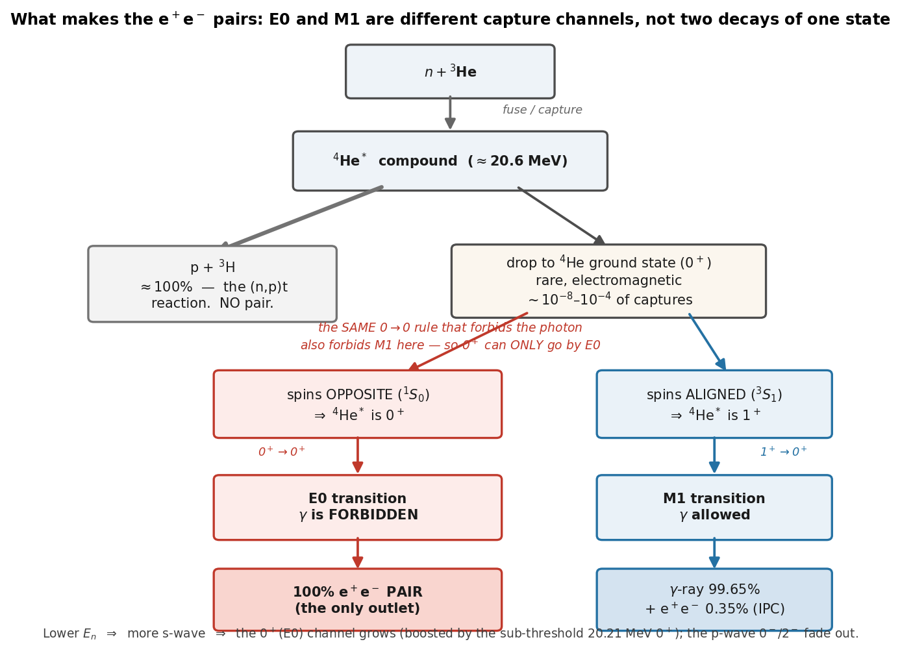

# How n + ³He makes e⁺e⁻ pairs — the whole thing, broken down simply

**For:** Dylan + collaborators · **Date:** 2026-06-14
*Start-here overview. Detail lives in [`doorway_states_note.md`] (the s/p-wave
calculation), [`ipc_estimation_method.md`] (the pair-yield numbers + references),
and [`ipc_roadmap.md`] (the plan).*

---

## The question this answers

> "Can the 0⁺ transition go by either E0 or M1?"

**No — and that confusion is worth clearing up, because it's the key to the
whole picture.** A 0⁺→0⁺ transition can go *only* by **E0**. The **M1** in our
story is a **completely different capture channel**, not an alternative way for
the 0⁺ to decay.

## The selection-rule rule, in plain words

A photon — and an M1 — each carry **at least one unit of angular momentum**. A
transition between two spin-0 states (0 → 0) has **zero** angular momentum to
give them. So for 0⁺→0⁺:

- **γ-ray: forbidden.** (No "monopole photon" exists.)
- **M1: forbidden.** (Same reason — it needs ≥1 unit.)
- **E0: allowed.** E0 is the *loophole*: the nucleus hands its energy straight
  to an e⁺e⁻ pair (or a conversion electron) through a virtual photon, which
  *can* be monopole. **For a 0⁺→0⁺ transition, the e⁺e⁻ pair is the only outlet
  — 100 % of the time.**

So "0⁺ → E0" is forced. There is no M1 option for it.

## Where the M1 comes from: it's a different channel

When the neutron and ³He fuse, **how their spins line up** decides what ⁴He\*
state you make (both are spin-½, captured in s-wave):

| spins | channel | ⁴He\* is | → ground state | γ? | pairs? |
|---|---|---|---|---|---|
| **opposite** | ¹S₀ | **0⁺** | **E0** | forbidden | **100 % pairs** (γ-dark) |
| **aligned** | ³S₁ | **1⁺** | **M1** | allowed | γ (99.65 %) + 0.35 % pairs |

These are **two parallel doorways**, not two decays of one state:

- The **0⁺ doorway → E0** → every such capture is a pair. This is *invisible* to
  the usual radiative-capture number (ENDF MT=102, the 54 µb), because that
  number only counts γ-emitting captures, and E0 emits no γ.
- The **1⁺ doorway → M1** → this *is* the 54 µb σ(n,γ); it emits a 20.6 MeV γ,
  and ~0.35 % of those γ's convert internally to a pair (the α_IPC ≈ 3.5×10⁻³).

(The dominant fate of ⁴He\* is neither — it just breaks back up into p + ³H,
the (n,p)t reaction, ~100 % of captures. The pairs are the rare EM sliver.)

## How this changes with neutron energy

This is where the doorway calculation comes in (`doorway_states_note.md`):

- **Lower $E_n$ → more s-wave.** Both the E0 (¹S₀) and M1 (³S₁) channels are
  s-wave, so both survive to low energy; the p-wave states (0⁻ at 21.0, 2⁻ at
  21.8) are barrier-suppressed and fade out below ~MeV. *(That's the answer to
  the earlier 0⁻ question: not forbidden, just barrier-suppressed — it actually
  peaks near $E_n\approx0.6$ MeV.)*
- **Within the pair channels, E0 and M1 then split by energy:**
  - **E0** is pure s-wave and is *boosted* by the 20.21 MeV 0⁺ state sitting
    just below threshold → **strongest at the lowest $E_n$**, fading upward.
  - **M1/E1** rides the radiative-capture cross section, which *climbs* ~10⁴×
    from thermal to MeV (the E1 / giant-dipole turning on) → **strongest in the
    MeV region**.

So the two pair sources sit at **opposite ends** of the energy range (see
`fig_e0_pair_yield.png`): **E0 pairs at thermal/sub-keV, M1/E1 pairs at MeV.**

## What we know vs. what we don't

| piece | status |
|---|---|
| M1/E1 pair yield vs $E_n$ (the MeV peak) | **have it** — campaign (n,γ) rate × α_IPC≈3.5×10⁻³ |
| The *shape* of the E0 yield (low-$E_n$, falling upward) | **have it** — s-wave + sub-threshold 0⁺ |
| The *height* of the E0 yield ($f=\sigma_{E0}/\sigma_{M1}$) | **unknown** — the nuclear matrix element |

The one missing number is **how strong the E0 (¹S₀) capture channel is relative
to the M1 (³S₁)**. That is a nuclear-structure quantity: it's anchored by the
⁴He(e,e′) monopole form factor (the measured 0⁺→0⁺ strength, the "α-particle
monopole puzzle") but turning that into a *capture* rate needs a ⁴He R-matrix
(roadmap Phase 2). Everything else — the channel structure, the multipoles, the
opposite energy trends — is settled and shown above.

### The one-line takeaway
There are two pair channels, set by spin alignment in the capture: **0⁺→E0**
(γ-forbidden, all pairs, low-energy) and **1⁺→M1** (γ-bright, 0.35 % pairs,
MeV). The 0⁺ cannot go by M1 — only E0 — and as the neutron energy drops we make
relatively more of those 0⁺ (E0) pairs.
