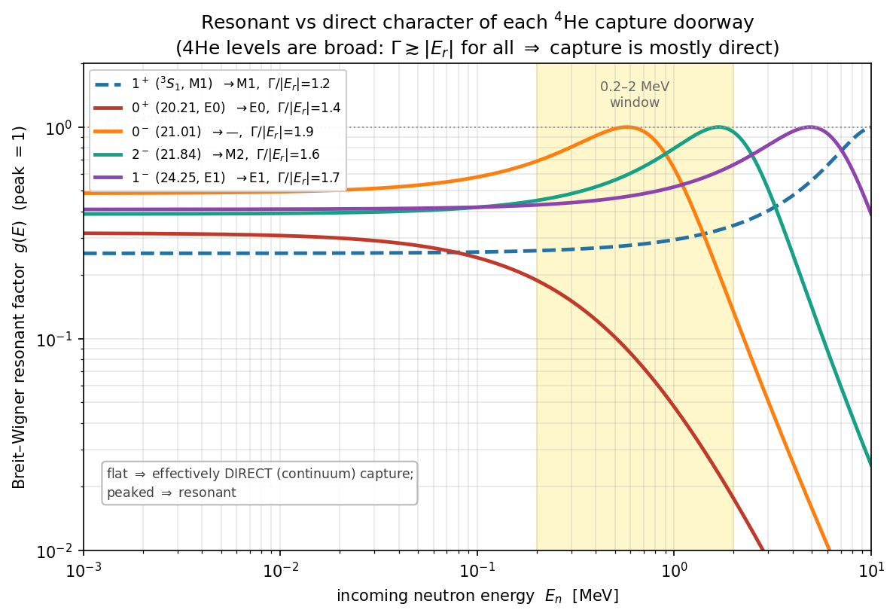
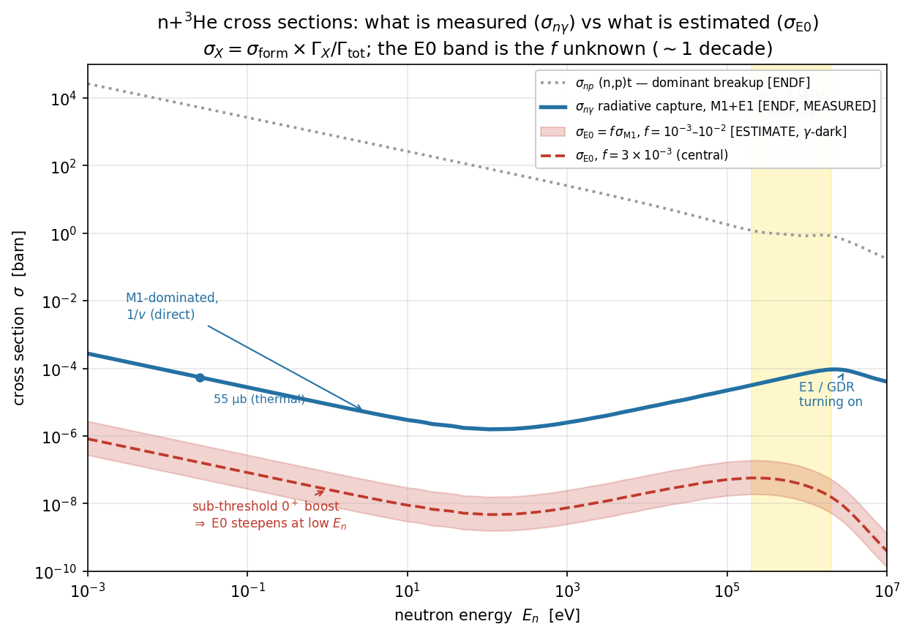

# Part 1 in depth — forming the ⁴He\* doorway: data, continuum vs resonance, and the relative transition probabilities

**For:** Dylan · **Re:** the E0 thread, Part 1 (Formation) in full detail
**Date:** 2026-06-15 (expanded from the 2026-06-14 0⁺/0⁻ note)
*This is the deep-dive behind Part 1 of the spine ([`formation_and_decay.md`]).
It answers four things: (1) where the level-diagram data comes from and how to
read it; (2) what "continuum vs resonance" actually means here; (3) how we
estimate the relative probability of the different transitions vs neutron
energy, and where the apparent "1⁺ dominates" came from; (4) whether the M1
continuum capture is really the dominant radiative mechanism, with literature.*

---

## 0. The structure of the problem (orientation)

A captured neutron makes a compound ⁴He\* at ≈20.6 MeV, which can in principle
reach the 0⁺ ground state and emit an e⁺e⁻ pair. The pair yield is a **product
of two independent factors**:

```
N_pair(Jπ, E_n)  =  FORMATION(Jπ, E_n)        ×   EM-DECAY-TO-G.S.(Jπ)
                    "which doorway, how much"      "does it radiate, as what,
                    (Part 1 — this note)            with what pair fraction"
                                                    (Part 2)
```

**Everything in this note is the first factor only — the entrance channel.** It
is essential to keep this separate from the second factor, because the second
(the electromagnetic matrix element: M1 vs E1 vs E0 strength) is where most of
the real hierarchy lives, and it is *measured*, not computed from the entrance
physics. Conflating the two is exactly what made the old doorway plot
misleading (§4).

---

## 1. The level-diagram data: where it comes from and how to read it


### 1.1 Source: the TUNL A=4 evaluation

The energies, spin-parities `Jπ`, isospins `T` and widths `Γ` are from the
**TUNL A=4 evaluation** — Tilley, Weller & Hale, *Energy Levels of Light Nuclei
A=4*, Nucl. Phys. A **541** (1992) 1. TUNL (Triangle Universities Nuclear
Laboratory) maintains the standard *evaluated* compilations for light nuclei:
an evaluation is not a single measurement but a critical synthesis of **all**
the world's scattering and reaction data on a given mass number into a single
recommended set of level parameters. For A=4 the data feeding it are the
measured cross sections of **n+³He, p+³H, d+d** (elastic scattering and
reactions) across the relevant energy range. G. M. Hale's **⁴He R-matrix** is
the engine of that evaluation — it is the multi-channel fit whose poles *are*
these "levels."

### 1.2 What the columns mean

- **E_x** — excitation energy above the ⁴He ground state, in MeV.
- **Jπ** — total angular momentum and parity of the state.
- **T** — isospin (0 or 1). This matters: ⁴He's ground state is **T=0**, and
  isospin controls which EM transitions are allowed (§5).
- **Γ** — total width. By the uncertainty principle a state of width Γ lives for
  τ ≈ ℏ/Γ; Γ = 1 MeV ↔ τ ≈ 6.6×10⁻²² s. These widths are **huge**
  (0.5–13 MeV), i.e. the states barely live long enough to be called states.

### 1.3 The single most important interpretive point

**⁴He has exactly one bound state — the 0⁺ ground state.** Every entry above it
sits in the **continuum**, above the particle-breakup thresholds (p+³H at 19.81,
n+³He at 20.58, d+d at 23.85 MeV). So the things drawn at 20–28 MeV are **not
bound levels**; they are **broad resonances** — poles of the scattering matrix
extracted from the R-matrix fit. A neutron "captured" into one of them is really
just `n+³He` scattering with a time delay of order ℏ/Γ before it flies apart
again. This is why:

- the widths are MeV-scale (a bound state has Γ=0; a sharp resonance has Γ≪
  spacing; these are neither);
- the dominant fate of every one of them is to **break back up** into p+³H or
  n+³He (the ~100% (n,p)t channel), not to radiate;
- the whole question of "resonant vs direct capture" (§3) even arises.

The y-axis in the figure is **broken between 4 and 16 MeV**: there is a ~20 MeV
gap between the bound ground state and the first excited state, so the break lets
the excited-state cluster spread out while still showing where the ground state
is. The **band thickness = Γ** (the states visibly overlap), **colour = how the
state would decay to the 0⁺ g.s.** (E0 red, M1 blue, E1 green, spectators grey),
and the bracketed tag gives the **entrance partial wave** (s or p) and the g.s.
transition multipole.

Two features to read off, both central to the story:
- **The 0⁺ (20.21 MeV) is the only sub-threshold state** — it sits 0.37 MeV
  *below* the n+³He threshold, so neutrons reach it through its tail (§3.3).
- **There is no low-lying 1⁺.** The lowest 1⁺ is at ~28.3 MeV, 7.7 MeV *above*
  threshold and 9 MeV wide — so the M1 capture cannot go through a 1⁺ resonance;
  it must be **direct** (§3, §5).

---

## 2. The partial-wave / spin bookkeeping (what can form, and as what)

n (spin ½) + ³He (spin ½) fuse with relative orbital angular momentum ℓ. Two
rules fix which Jπ you can build:

- **Parity:** intrinsic parities are both +, so the compound parity is
  π = (−1)^ℓ. Even ℓ → positive-parity states; odd ℓ → negative.
- **Channel spin:** the two ½-spins couple to **S = 0 (singlet)** or
  **S = 1 (triplet)**; then **J = S ⊕ ℓ**.

| entrance | term | ℓ | π | states reached |
|---|---|---|---|---|
| s-wave | ¹S₀ | 0 | + | **0⁺** |
| s-wave | ³S₁ | 0 | + | **1⁺** |
| p-wave | ³P₀ | 1 | − | **0⁻** |
| p-wave | ¹P₁, ³P₁ | 1 | − | **1⁻** |
| p-wave | ³P₂ | 1 | − | **2⁻** |

So the **positive-parity** doorways (0⁺, 1⁺) are **s-wave**, the
**negative-parity** ones (0⁻, 1⁻, 2⁻) are **p-wave**. That single fact drives
the entire energy dependence, through the centrifugal barrier (§3.2).

---

## 3. Continuum (direct) vs resonance — the physics in detail

This is the distinction the level diagram forces on us, and it is worth getting
precise because it is *the* reason the energy dependences differ.

### 3.1 Two mechanisms for radiative capture

**Resonant (compound) capture.** The neutron and ³He genuinely *form* a
quasi-bound ⁴He\* state at a definite energy E_r — a pole of the S-matrix. The
system lives ~ℏ/Γ, "forgets" how it was made, and then de-excites (usually by
breaking back up; rarely by radiating). The cross section shows a **Breit–Wigner
peak** at E_r:
```
σ_res(E) ∝ Γ_n(E) Γ_γ / [ (E − E_r)² + (Γ/2)² ]
```
This is the textbook picture (a sharp level you can capture *onto*).

**Direct capture.** The neutron is captured **straight into the final bound
state** (here the ⁴He 0⁺ g.s.), emitting the photon (or pair) *during* the
collision, without ever forming a long-lived intermediate. The amplitude is the
overlap of the incoming scattering wavefunction with the final bound-state
wavefunction, sandwiching the EM operator:
```
σ_dir(E) ∝ | ⟨ ψ_bound | O_EM | ψ_scatt(E) ⟩ |²
```
It has **no peak** — it varies smoothly, tracking the penetrability and the 1/v
flux factor. (Classic formalism: Christy & Duck, Nucl. Phys. **24** (1961) 89;
see Rolfs & Rodney, *Cauldrons in the Cosmos*.)

### 3.2 The criterion, and why ⁴He is the extreme "all-direct" case

A level acts as a **sharp resonance** only if its width is small compared to
both the level spacing *and* its distance from the capture window:
`Γ ≪ |E − E_r|`. If instead `Γ ≳ |E − E_r|`, the Breit–Wigner is so broad that
across the whole window it looks like a smooth background — i.e. **effectively
direct capture, modulated by broad structure.**

For ⁴He *every* level fails the sharpness test:



The plot is the Breit–Wigner factor `g(E) = (Γ/2)²/[(E−E_r)²+(Γ/2)²]` (peak = 1)
across the capture window. **Flat ⇒ direct; peaked ⇒ resonant.** Every curve has
`Γ/|E_r| ≈ 1.2–1.9` — there is no sharp resonance anywhere. So **⁴He capture is
mostly direct (continuum) capture**, modulated by broad resonant structures. Two
consequences:

- **1⁺ (M1): pure direct.** Its nearest level is 7.7 MeV away and 9 MeV wide, so
  g(E) is essentially flat (g_thr/g_1MeV ≈ 0.8). The famous ~54 µb M1 capture is
  **direct continuum capture** — which is *why* ³He(n,γ) follows a clean 1/v with
  no thermal resonance.
- **0⁺ (E0): direct + a sub-threshold boost** (§3.3).

### 3.3 The sub-threshold 0⁺ boost

The 0⁺ at 20.21 MeV is 0.37 MeV *below* the n+³He threshold. Its Breit–Wigner
tail still reaches above threshold and **enhances the s-wave (¹S₀) amplitude near
threshold** — strongest at the lowest E_n (closest to the pole) and fading as
E_n climbs. Numerically the boost is ~6–10× at threshold relative to 1 MeV. This
is a real (but broad) low-energy enhancement, and it is special to the E0/0⁺
channel — the M1/1⁺ channel has no such nearby pole. (Sub-threshold resonances
enhancing near-threshold cross sections are standard in low-energy nuclear
astrophysics S-factors.)

---

## 4. The formation calculation, decomposed — and the "1⁺ dominance" corrected


The entrance ("formation") cross section into each doorway factorises cleanly
(`scripts/calc_doorway_formation.py`):
```
σ(Jπ, E_n)  ∝  (1/k²)  ×  g_J  ×  P_ℓ(E)  ×  M(E)
               geometric   spin    barrier    structure
```

- **(1/k²)** — the geometric factor (πλ̄²), ∝ 1/E_cm. Combined with the s-wave
  penetrability P₀ ∝ k it reproduces the **textbook 1/v capture law**
  (σ ∝ 1/k²·k = 1/v); for p-wave it gives σ ∝ 1/k²·k³ = k² (the barrier
  turn-on). It is common to all channels at fixed ℓ, so it **drops out of any
  same-ℓ ratio** (e.g. 1⁺/0⁺). *(Plot the cross-section-like σ here, which rises
  as 1/v toward low E_n; an earlier draft plotted σv, the rate, which is flat
  for s-wave and looked wrong — fixed.)*
- **g_J = (2J+1)/[(2s₁+1)(2s₂+1)] = (2J+1)/4** — the **spin-statistical weight**.
  For the s-wave pair: g(1⁺)=3/4, g(0⁺)=1/4. Physically, two unpolarised ½-spins
  make the **triplet (³S₁→1⁺) 3× more often than the singlet (¹S₀→0⁺)**. This
  factor of 3 is fixed and real.
- **P_ℓ(E)** — the centrifugal **penetrability**: s-wave ∝ ρ (the 1/v law, no
  barrier); p-wave ∝ ρ³ (barrier-suppressed at low E, turning on toward MeV).
  This is what puts s-wave (0⁺,1⁺) at low E_n and p-wave (0⁻,2⁻,1⁻) at MeV
  (bottom panel of the figure).
- **M(E)** — the **structure modulation**: 1 for a smooth direct channel (1⁺),
  the sub-threshold boost for the 0⁺ (§3.3), a peaked Breit–Wigner for the
  above-threshold p-wave resonances.

### Where the "1⁺ dominates by an order of magnitude" came from — and why it was wrong

The previous version of the plot used an **ad-hoc flat factor (`F = 4/Γ_ref`
with Γ_ref = 1 MeV)** for the direct 1⁺ channel. That number had no physical
basis, and it sat ~order-of-magnitude above the 0⁺'s Breit–Wigner value — so the
1⁺ appeared to dominate everywhere, growing to ~100× by 3 MeV. **That was an
artifact of the normalisation, not physics.** Decomposing the honest ratio (both
states are s-wave, so 1/v and P₀ cancel *exactly*):

```
S(1⁺)/S(0⁺) = g(1⁺)/g(0⁺) × 1/boost_0⁺(E) = 3 / boost_0⁺(E)
```

| E_n | boost_0⁺ | S(1⁺)/S(0⁺) |
|---|---|---|
| 1 keV  | 6.6 | **0.45** (0⁺ slightly ahead) |
| 100 keV | 5.1 | 0.59 |
| 300 keV | 3.2 | 0.95 (≈ equal) |
| 1 MeV  | 1.0 | 3.0 (pure spin factor) |
| 3 MeV  | 0.19 | 15.8 |

**So the 1⁺ does NOT dominate at low energy.** At thermal the ×3 spin weight
favouring 1⁺ is *cancelled* by the ×6.6 sub-threshold boost favouring 0⁺ — the
two s-wave doorways are **comparable**, and the 0⁺ is even slightly ahead. The
gap only opens toward MeV, as the 0⁺ boost fades. This matters for the E0 story:
the E0 doorway is **as easy to form as the M1 doorway** at the low energies where
E0 lives.

**The honesty caveat (now stated on the plot):** absolute heights *across
different ℓ* (s-wave vs p-wave) still carry the arbitrary equal-reduced-width
assumption and are **not** physical — only the **shapes** (turn-on energies) and
the **same-ℓ 1⁺/0⁺ comparison** above are. The p-wave 0⁻ peaks at E_n ≈ 0.65 MeV,
2⁻ and 1⁻ higher — that *shape* is robust; their height relative to the s-wave
curves is not.

### 4.1 "Does the 0⁺ dominate at thermal?" — three different ratios, don't conflate them

This is the crux of the confusion, so let me separate it carefully. There are
**three** distinct 0⁺-vs-1⁺ ratios, and the doorway figure shows only the first:

1. **Formation (entrance) ratio** — *how often we MAKE each compound state.*
   σ_form(0⁺)/σ_form(1⁺) ≈ **1–2 at thermal** (the figure). The 0⁺ is *comparable
   to, perhaps mildly above*, the 1⁺ — because its sub-threshold boost beats the
   3:1 spin weight. **This is the only thing the figure shows.**
2. **EM transition-width ratio** — *given the state, how readily it radiates to
   the g.s.* Γ_E0/Γ_M1. This is **not** in the figure at all. It is the genuine
   nuclear unknown, and it strongly favours **M1** (E0 has no real-photon mode,
   so its width is intrinsically ~10²–10³× smaller than a comparable M1).
3. **Pair-yield ratio** — *e⁺e⁻ pairs out.* N_pair(E0)/N_pair(M1) =
   (σ_form·Γ_E0·1) / (σ_form·Γ_M1·α_IPC). Because E0 is 100 % pairs while M1
   pays the 0.35 % IPC penalty, this comes back up to **~0.3–3** (the f/α_IPC
   bracket).

So: **the 0⁺ does NOT "dominate the transition" at thermal.** What is true is
that the 0⁺ is *formed* about as often as the 1⁺ (ratio 1), but the *capture
cross section* σ_E0 = f·σ_M1 is much smaller (because ratio 2, Γ_E0/Γ_M1 ≈ f,
is small) — and only the **pair yield** (ratio 3) climbs back to comparable,
thanks to E0 dodging the IPC penalty. The single number that ties ratios 2 and 3
together is **f = σ_E0/σ_M1**, which already bundles the (small) formation
difference *and* the EM-width difference; it is bracketed 10⁻³–10⁻², not known.

### 4.2 What is KNOWN vs ESTIMATED vs UNKNOWN (read this before quoting anything)

| quantity | status | basis / what it would take to pin |
|---|---|---|
| level energies, Jπ, T, widths Γ | **known** (measured) | TUNL A=4 evaluation |
| 0⁺→0⁺ ⇒ E0, γ-dark, 100 % pairs | **known** (exact rule) | angular-momentum/parity selection |
| 3:1 ³S₁:¹S₀ spin-statistical weight | **known** (exact) | unpolarised spin counting |
| s-wave→1/v, p-wave barrier turn-on (shapes) | **known** (QM) | neutral-particle penetrabilities |
| thermal capture is M1-dominated, ~54 µb; E1 rises to GDR | **known** (measured) | Wolfs PRL 63; Wervelman NPA 526; isospin |
| **formation ratio σ(0⁺)/σ(1⁺) absolute value** | **estimated, rough** | equal reduced widths assumed; needs R-matrix reduced widths/ANC |
| **magnitude of the 0⁺ sub-threshold boost** | **estimated, rough** | single-level BW tail; needs R-matrix/ANC |
| cross-ℓ absolute heights (s vs p) in the figure | **not physical** | arbitrary equal θ²; shapes only |
| **f = σ_E0/σ_M1 (the E0 strength)** | **UNKNOWN, bracketed 10⁻³–10⁻²** | ⁴He R-matrix + (e,e′) monopole norm. |

**Bottom line on the figure's status:** it is an **illustrative/semi-quantitative
sketch**, not a hard calculation. Hard in it: the penetrability functional forms,
the spin weights, the level parameters, and the *shapes*. Soft in it: every
absolute height and cross-channel comparison (equal-reduced-width assumption),
and the boost magnitude. Absent from it entirely: the EM matrix elements
(ratios 2–3), which is where the dominant uncertainty (f) lives.

**On uncertainties (for later):** a defensible error budget will have to combine
(a) the formation-ratio uncertainty — best done by replacing the equal-θ² sketch
with the actual ⁴He R-matrix reduced widths (factor ~2–3 today), and (b) the
**dominant** term, the order-of-magnitude span on f (10⁻³–10⁻², i.e. ±1 decade),
which only the R-matrix + (e,e′) normalisation can shrink. Until (b) is pinned,
any pair-yield number for E0 carries roughly an **order-of-magnitude** band — so
quote it as a band, not a central value.

---

## 5. Is continuum M1 really the dominant radiative mechanism? (the second factor)

The doorway strengths above say nothing about *radiation* — that is the second
factor, the EM matrix element, and it is here that "M1 vs E1 vs E0" is decided.
For ³He(n,γ)⁴He this is **measured**, and the answer is yes:

- **Thermal capture is M1-dominated and direct.** The thermal ³He(n,γ)⁴He cross
  section is ~**54 µb** (Wolfs et al., Phys. Rev. Lett. **63** (1989) 2721),
  dominated by the **M1** transition ³S₁ → 0⁺ g.s. Wervelman et al.
  (Nucl. Phys. A **526** (1991) 265) measured the M1/E1 decomposition directly.
- **Why M1 and not E1 at low energy — isospin.** ⁴He is self-conjugate (N=Z),
  ground state **T=0**. The **E1 operator is isovector**, and a ΔT=0 isovector
  E1 transition (T=0 → T=0) is **isospin-forbidden** in a self-conjugate
  nucleus. So E1 capture to the g.s. can only proceed through the **T=1**
  component of the continuum — i.e. via the **T=1 1⁻ states (the giant dipole
  resonance** at 24–26 MeV). At threshold that strength is far away and weak;
  it **turns on toward MeV**, which is exactly the ~10⁴× rise of σ_nγ from
  thermal to the MeV region seen in the ENDF ratio
  (`figs/fig_he3_xs.png`). The lower 1⁻ (T=0, 24.25 MeV) does *not* help — its
  E1 to the T=0 g.s. is also isospin-hindered.
- **Why the M1 itself is small (~54 µb).** Even the dominant M1 is a *direct*
  (non-resonant) capture with a modest spin-flip matrix element — there is no 1⁺
  resonance to enhance it. This is why ³He(n,γ) is a famously *weak* thermal
  capture, and why the sub-keV X17 program is rate-starved (the MeV note).

So: **M1 dominates the radiative (photon-emitting) capture at low E_n; E1 takes
over toward the GDR; both are direct/continuum, not resonant.** The E0 (0⁺→0⁺)
channel is *parallel* to all of this — γ-dark, 100% pairs, strength `f` unknown.

---

## 5.5 The full capture cross section = formation × branching (the final cross-section plot)

Putting Part 1 (formation) and Part 2 (decay) together, the capture cross
section into any final channel **factorises into a product**:

```
σ(n, X)  =  σ_form(Jπ, E)  ×  [ Γ_X / Γ_tot ]
            "form the state"    "radiate as X, rather than break up"
```

For an isolated resonance this is exact (the Breit–Wigner factorises). ⁴He
capture is mostly *direct*, where formation and radiation are really one matrix
element — but the cross section still separates into a **kinematic/penetrability
factor × an EM-strength factor**, so the product is the right way to organise it
(just not a literal two-step process). Per channel:

```
σ_M1 = σ_form(1⁺) · Γ_M1/Γ_tot          σ_E0 = σ_form(0⁺) · Γ_E0/Γ_tot
```
and `Γ_tot ≈ Γ_n + Γ_p` (breakup) ≫ Γ_γ, which is why capture is so rare next to
the (n,p)t channel.

**The crucial leverage:** the photon-emitting part (M1+E1) is **measured** — it
is exactly the ENDF (n,γ) cross section we already have. So the *only* thing we
estimate is `σ_E0 = f · σ_M1`. That is the "final cross-section" plot:



- **σ_np (n,p)t (grey, dotted):** the dominant breakup channel — 5330 b at
  thermal. This is `Γ_n+Γ_p` and sets Γ_tot.
- **σ_nγ (blue, MEASURED):** the total radiative capture (M1+E1), ENDF/B-VIII.0
  — 55 µb at thermal (the classic value), showing the **M1-dominated 1/v** at
  low E and the **E1/GDR rise** toward MeV. *This curve is known.*
- **σ_E0 (red band, ESTIMATE):** `f·σ_M1` with the sub-threshold 0⁺ boost; the
  band is `f = 10⁻³–10⁻²`. σ_E0(thermal) ≈ 0.055–0.55 µb. *γ-dark — invisible
  to the blue curve.* The **band width is the dominant (≈1-decade) uncertainty**;
  the shape (1/v × subthreshold boost) is robust.

This is the cross-section-level statement of the whole thread: a measured,
photon-emitting capture (blue) and a γ-dark E0 capture (red band) ~4–5 decades
below it, whose absolute size is the open `f`. Folding these through flux,
acceptance and the trigger window gives the recorded-pairs metric
([`../report/e0_final_metric_note.tex`]). Reproduce:
`scripts/make_e0_cross_section_fig.py`.

## 6. How to estimate the relative transition probabilities vs energy

Putting the two factors together, the relative pair yield of channel Jπ is
```
N_pair(Jπ, E_n) ∝  [ (1/v) g_J P_ℓ(E) M(E) ]   ×   [ σ_EM(Jπ) / σ_breakup ]
                    └── formation (this note) ──┘     └── radiative branching ──┘
```
What each piece costs:

| piece | how we get it | status |
|---|---|---|
| formation shapes (1/v, P_ℓ, spin, sub-thr boost) | penetrability + TUNL params (this note) | **have** (shapes robust, abs. heights not) |
| M1/E1 radiative branching vs E | **measured** — Wervelman; ENDF MT=102 ratio | **have** (it's the campaign (n,γ) curve) |
| E0 strength `f = σ_E0/σ_M1` | reasoned bracket 10⁻³–10⁻²; needs structure theory | **bracketed** |
| the rigorous all-in-one | **⁴He R-matrix with photon channels** (Hale), or AZURE2 | the real tool |

**The rigorous way** to get every relative transition probability *consistently*
vs energy is the **multi-level, multi-channel R-matrix** that already underlies
the TUNL evaluation (Lane & Thomas, Rev. Mod. Phys. **30** (1958) 257; Hale's
⁴He system). It handles the overlapping broad levels, their interference, and —
if the radiative channels are included — the M1/E1/E0 partial cross sections
directly. **AZURE2** (Azuma et al., Phys. Rev. C **81** (2010) 045805) is the
public code that can do this with the evaluated levels. Normalising the E0 piece
needs the measured ⁴He(e,e′) monopole strength (the "α-particle monopole
puzzle," Kegel et al. PRL **130** (2023) 152502) as the decay-side anchor. That
is the concrete Phase-2 ask for a ⁴He-theory contact — it is what replaces the
`f` bracket and the equal-reduced-width assumption with real numbers.

What we can responsibly say *without* it (and do, in the spine and the final
metric): the **shapes** are settled (E0/M1 at low E_n, E1 at MeV), the M1/E1
**heights** are anchored to data, and the **E0 height** is the one bracketed
unknown.

---

## 7. Honest caveats (unchanged in spirit, sharpened)

- The doorway plot is an **entrance-channel illustration**. Reduced widths are
  set equal (θ² = 0.1, a = 4 fm); the **shapes** and the **same-ℓ 1⁺/0⁺ ratio**
  are robust, the **cross-ℓ absolute heights are not**.
- It is **not** the radiative or pair branching — that is the second factor (§5),
  which multiplies each curve differently and is where M1/E1/E0 is decided.
- It is **not** a substitute for the multi-level ⁴He R-matrix, which is the only
  thing that gets the interference of the broad overlapping levels right.

---

## References

- **Levels / evaluation:** D. R. Tilley, H. R. Weller, G. M. Hale, *Energy
  Levels of Light Nuclei A=4*, Nucl. Phys. A **541** (1992) 1 (TUNL); G. M.
  Hale's ⁴He R-matrix.
- **Thermal ³He(n,γ)⁴He cross section:** F. L. H. Wolfs et al., Phys. Rev. Lett.
  **63** (1989) 2721.
- **M1/E1 content of ³He(n,γ)⁴He:** R. Wervelman et al., Nucl. Phys. A **526**
  (1991) 265.
- **R-matrix theory:** A. M. Lane & R. G. Thomas, Rev. Mod. Phys. **30** (1958)
  257. **AZURE2:** R. E. Azuma et al., Phys. Rev. C **81** (2010) 045805.
- **Direct-capture formalism:** R. F. Christy & I. Duck, Nucl. Phys. **24**
  (1961) 89; C. Rolfs & W. Rodney, *Cauldrons in the Cosmos*.
- **E0 decay-side strength (the α-particle monopole puzzle):** S. Kegel et al.,
  Phys. Rev. Lett. **130** (2023) 152502; arXiv:2306.07268.
- ENDF/B-VIII.0 ³He (`data/He3.h5`): MT=102 (n,γ), 103 (n,p), 2 (elastic).
