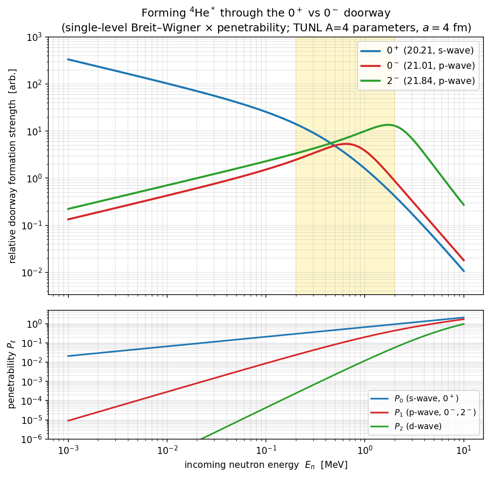
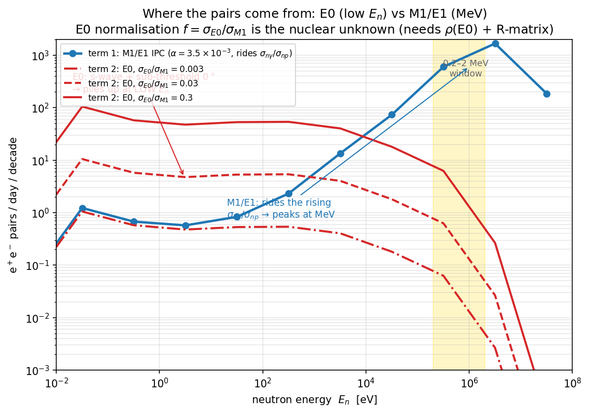

# Forming the 0⁺ vs 0⁻ doorway in n + ³He — a calculation to build intuition

**For:** Dylan · **Re:** the 0⁺/0⁻ confusion · **Date:** 2026-06-14

You asked whether the 0⁻ is "energetically forbidden" below 1 MeV, and whether
we can *calculate* the 0⁺ vs 0⁻ formation probability vs neutron energy. Yes —
here is a simple but faithful calculation, and it resolves the confusion.

## The one idea that explains everything: parity → angular momentum

n + ³He has intrinsic parity $(+)(+) = +$, so the parity of the compound state
is set by the orbital angular momentum $\ell$: $\pi = (-1)^\ell$. To build a
given $J^\pi$ you therefore need a specific $\ell$:

- **0⁺** (parity +): needs $\ell$ even → **s-wave ($\ell=0$)**. ($\ell=0,s=0\to J=0$.)
- **0⁻** (parity −): needs $\ell$ odd → **p-wave ($\ell=1$)**. ($\ell=1,s=1\to J=0$.)
- **2⁻**: also p-wave ($\ell=1,s=1\to J=2$).

That single difference — s-wave vs p-wave — dominates the energy dependence,
because the **centrifugal barrier** lets low-energy neutrons into $\ell=0$ for
free but keeps them out of $\ell\ge1$:

$$P_0 \propto v,\qquad P_1 \propto v^3,\qquad P_2\propto v^5 \quad(\text{low }E)$$

Folded with the $1/v^2 \sim 1/E$ flux factor, the *formation strength* goes as
$\sim 1/v$ for the 0⁺ (s-wave) — the familiar capture law, **blowing up at low
$E_n$** — and as $\sim v$ for the 0⁻ (p-wave) — **vanishing at threshold** and
switching on only as the neutron gets enough energy to climb the barrier.

## The calculation

Single-level Breit–Wigner with neutral-particle penetrabilities, using the
TUNL A=4 resonance parameters (0⁺: 20.21 MeV, Γ=0.50; 0⁻: 21.01 MeV, Γ=0.84;
2⁻: 21.84 MeV, Γ=2.01; n+³He threshold 20.578 MeV, so $E^\*=20.578+\tfrac34E_n$):

$$S_J(E)\propto \frac{1}{k^2}\,g_J\,\Gamma_n^J(E)\,\frac{\Gamma_J}
{(E_{\rm cm}-E_r)^2+(\Gamma_J/2)^2},\qquad \Gamma_n^J(E)=2P_\ell(E)\,\gamma^2$$

with equal reduced widths $\gamma^2$ for the comparison (`scripts/calc_doorway_formation.py`).

**What it gives:**

| $E_n$ | S(0⁺)/S(0⁻) |
|---|---|
| 1 keV | 2500 |
| 10 keV | 240 |
| 100 keV | 17 |
| **~0.5 MeV** | **1 (crossover)** |
| 1 MeV | 0.4 |

- The **0⁻ doorway peaks at $E_n\approx0.64$ MeV** ($E_{\rm cm}\approx0.48$ MeV,
  its resonance, nudged up by the rising barrier).
- Below ~0.5 MeV the **0⁺ (s-wave) outweighs the 0⁻ by 1–4 orders of
  magnitude**, growing without limit toward thermal.

## So, to your question

**The 0⁻ is not energetically forbidden below 1 MeV** — the n+³He channel is
open at all $E_n>0$ and $E^\*$ already exceeds threshold. What suppresses the
0⁻ at low energy is the **p-wave centrifugal barrier**, not energetics. And the
0⁻ actually *peaks just below 1 MeV* (~0.64 MeV); it is the higher 2⁻ states
that truly need $E_n\gtrsim1.5$ MeV. The 0⁺, by contrast, is s-wave and
dominates the low-energy region overwhelmingly.

This dovetails with the IPC picture (`ipc_estimation_method.md`): the
low-energy, s-wave **0⁺ is the γ-dark E0 pair source**, weighted to low $E_n$;
the 0⁻ cannot reach the 0⁺ ground state electromagnetically anyway
(0⁻→0⁺ is parity-forbidden for both γ and E0), so it is a spectator for the
pair signal — it mostly decays back by n/p emission.

## Honest caveats

This is an **illustration of the entrance-channel strength**, meant to show
*why* the energy dependence is what it is. It is **not**:
- the absolute rate or the EM/pair branching — those need the *outgoing* widths
  (to g.s. via E0/M1, or back to n/p) and would multiply each curve differently;
- a substitute for the real **multi-level ⁴He R-matrix** (Hale), which handles
  the overlapping broad levels and interference, and which is what Phase 2 of
  the IPC roadmap calls for. The reduced widths here are set equal
  ($\theta^2=0.1$) and the channel radius is $a=4$ fm; the *shapes* are robust
  to these, the absolute vertical offsets between curves are not.

## From doorway to pair yield — the punchline, in plain terms

Folding the 0⁺ s-wave physics into an actual pair-yield curve
(`scripts/make_e0_pair_yield_fig.py`):

There are **two ways the captured neutron makes an e⁺e⁻ pair**, and they live at
**opposite ends of the energy range**:

- **M1/E1 (ordinary radiative capture), blue.** The nucleus wants to emit a γ
  ray; about **0.35 %** of the time that γ comes out as an e⁺e⁻ pair instead
  (internal pair conversion, the α≈3.5×10⁻³). The *chance* of radiative capture
  (rather than the dominant n+p) grows ~10⁴× from thermal to MeV as the E1 /
  giant-dipole strength turns on — so these pairs **pile up in the MeV region**.
- **E0 (the 0⁺ monopole), red.** Here a γ is **forbidden** (0⁺→0⁺), so the
  transition can *only* make a pair — **100 %**, no 0.35 % penalty. It comes
  from pure s-wave capture (no MeV growth) and from the 0⁺ state sitting just
  *below* threshold, so it is strongest at the **lowest** neutron energies and
  fades upward. These pairs **pile up at thermal / sub-keV**.

So the picture flips depending on energy: **above ~10 keV the ordinary M1/E1
pairs dominate; below ~1 keV the E0 pairs can take over** — even if the E0
channel is only a few percent of the M1 strength, because it dodges the 0.35 %
IPC suppression. With $\sigma_{E0}/\sigma_{M1}=0.03$, E0 already gives ~30
pairs/day below 1 keV, where ordinary IPC gives only a handful. **That
potentially revives the sub-keV region we had written off** as a place to look
for pairs.

**The one thing we don't know yet** is the *height* of the red curve — i.e. how
big the E0 channel really is ($f=\sigma_{E0}/\sigma_{M1}$, shown for
0.003 / 0.03 / 0.3). That single number is set by the nuclear E0 strength
$\rho$(E0), which the ⁴He(e,e′) monopole data + a ⁴He R-matrix will pin down
(roadmap Phase 2). The **shape** — E0 at low energy, M1/E1 at MeV — is robust
and doesn't depend on that number.
