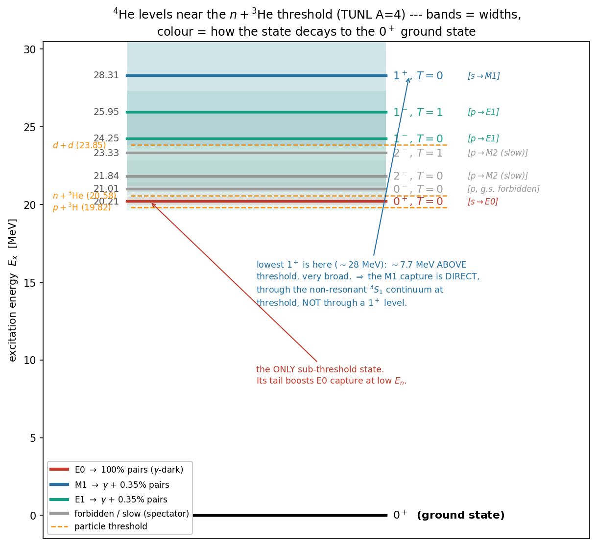

# The pair problem in two parts: Formation, then Decay

**For:** Dylan + collaborators · **Date:** 2026-06-14
*This is the new spine for the write-up. The problem splits cleanly into
**(1) which excited state we form** and **(2) how that state decays** — linked by
the spin-parity $J^\pi$ of the state. The energy dependence lives almost entirely
in Part 1; the "is there a pair" lives in Part 1.*

---

## Part 1 — Formation: which \(^4\)He\(^*\) state do we make?

### The states that exist (and the 1⁺ surprise)

The states near the $n+{}^3$He threshold (20.58 MeV), from the TUNL evaluation.
Two things to read off:

- The states are **broad and overlapping** (widths 0.5–13 MeV) — \(^4\)He has no
  sharp levels above threshold.
- **There is no low-lying 1⁺ state.** The lowest 1⁺ sits at **~28.3 MeV**, ~7.7
  MeV *above* threshold and very broad. This matters (next).

### Which states can a captured neutron reach, and when?

Parity fixes the entrance orbital angular momentum, $\pi=(-1)^\ell$:

| reached by | $\to$ states | energy behaviour |
|---|---|---|
| **s-wave** ($\ell=0$) | $0^+$, $1^+$ | no barrier — rise as $1/v$, **dominate at low $E_n$** |
| **p-wave** ($\ell=1$) | $0^-$, $2^-$, $1^-$ | barrier-suppressed — **switch on at sub-MeV/MeV** |

**The 1⁺ subtlety (your question).** The $1^+$ is reached by s-wave, but since
the nearest $1^+$ *level* is 28 MeV away, the $1^+$ capture is **non-resonant
direct capture** through the $^3S_1$ continuum — not capture through a level.
That is why you never see a $1^+$ in the level diagram at our energy: there
isn't one there. By contrast the $0^+$ *does* have a real (sub-threshold)
resonance at 20.21 MeV boosting it. So:

- **$0^+$ and $1^+$ (s-wave)** both dominate at low $E_n$; the $0^+$ gets an
  extra low-energy boost from its sub-threshold resonance.
- **$0^-$, $2^-$ (p-wave)** peak at $E_n\approx0.6$ and $\approx1.7$ MeV
  respectively — *not forbidden* at low energy, just barrier-suppressed.

**Bottom line of Part 1:** as the neutron energy drops, we form relatively more
$0^+$ and $1^+$ (s-wave); the p-wave states fade out.

---

## Part 2 — Decay: what does each state do?

Every \(^4\)He\(^*\) almost always just **breaks back up** into $p+{}^3$H (the
(n,p)t reaction) or $n+{}^3$He — that is the $\sim$100 % fate and makes no pair.
The rare ($10^{-8}$–$10^{-4}$) **electromagnetic drop to the $0^+$ ground state**
is the only pair source, and *what kind* of drop is fixed by the state's
$J^\pi$. Treating each state on its own:

| State | $E_x$ | $\to0^+$ g.s. | allowed? | if it goes EM, pairs? | role for our signal |
|---|---|---|---|---|---|
| **$0^+$** | 20.21 | **E0** | yes (only E0) | **100 %** ($\gamma$ forbidden) | **E0 pair source** — low $E_n$ |
| **$1^+$** | (³S₁ cont.) | **M1** | yes | 0.35 % (IPC of the $\gamma$) | **M1 pair source** — the ordinary 54 µb capture |
| **$1^-$** | 24–26 | **E1** | yes | 0.35 % (IPC of the $\gamma$) | **E1 pair source** — turns on toward MeV |
| **$0^-$** | 21.01 | — | **no** ($0\to0$ + parity flip: $\gamma$, E0, M1 all forbidden) | — | **spectator** (breaks back up) |
| **$2^-$** | 21.84 | M2 | technically (slow) | negligible | **spectator** |

Reading each row:

- **$0^+\to0^+$: E0.** A $\gamma$ is forbidden ($0\to0$), so the *only* outlet is
  an $e^+e^-$ pair — **100 % of the EM transitions are pairs.** This is the
  $\gamma$-dark channel, invisible to ENDF/Geant4.
- **$1^+\to0^+$: M1.** Emits a 20.6 MeV $\gamma$; $\sim$0.35 % of those convert
  internally to a pair ($\alpha_{\rm IPC}\approx3.5\times10^{-3}$). This *is* the
  ordinary radiative capture (the 54 µb).
- **$1^-\to0^+$: E1.** Same story as M1 (a $\gamma$ with a 0.35 % pair tail), but
  reached by p-wave, so it grows toward MeV — this is what makes the radiative
  cross section rise (the giant-dipole turning on).
- **$0^-\to0^+$: nothing.** $0\to0$ forbids every photon multipole *and* E0
  needs no parity change, so a $0^-\to0^+$ E0 is forbidden too. The $0^-$ simply
  decays back to particles. (So even though the $0^-$ peaks near 0.6 MeV, it
  contributes no g.s. pairs — a pure spectator.)
- **$2^-\to0^+$: M2,** very slow at 20 MeV; the state breaks up long before it
  radiates. Spectator.

**Bottom line of Part 2:** only **three** states make ground-state pairs —
$0^+$ (E0, all pairs), $1^+$ (M1) and $1^-$ (E1, both 0.35 % pairs). The $0^-$
and $2^-$ are spectators.

---

## Putting the two parts together (preview)

- **Part 1 sets the *shape* in energy.** E0 ($0^+$, s-wave + sub-threshold boost)
  $\Rightarrow$ low $E_n$. M1 ($1^+$, s-wave) $\Rightarrow$ low $E_n$ but no
  resonant boost. E1 ($1^-$, p-wave) $\Rightarrow$ MeV.
- **Part 2 sets the *height* per formation.** E0 = 100 % pairs; M1/E1 = 0.35 %
  pairs; $0^-/2^-$ = 0.

So the pair yield is a sum over the three source states, each = (formation shape,
Part 1) $\times$ (pair fraction, Part 2). The one number still missing is the
**E0 radiative strength** — i.e. how often the $0^+$ doorway actually makes its
E0 transition to the ground state rather than breaking up. That is the
$f=\sigma_{E0}/\sigma_{M1}$ unknown (bracketed $10^{-3}$–$10^{-2}$, see
[`ipc_estimation_method.md`]); everything else here is settled. Combining these
into X17/IPC pairs per pulse is the next step.
