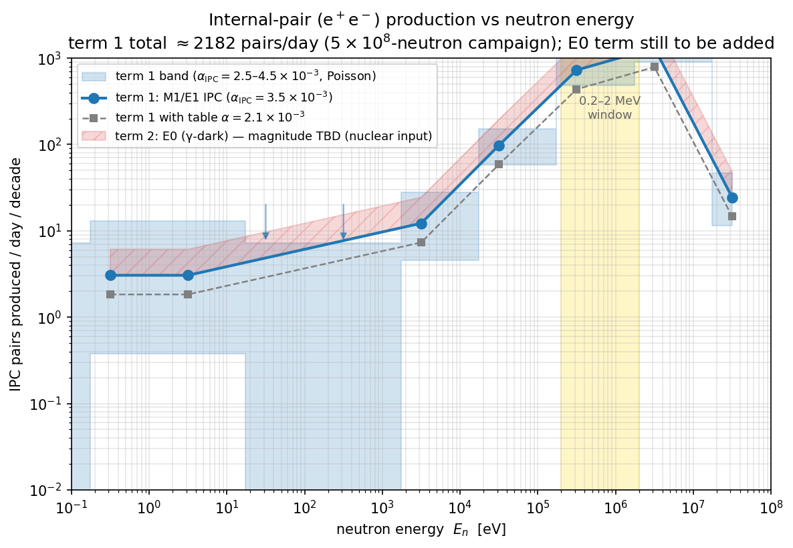

# How to estimate the IPC pair yield vs neutron energy — method + tool findings

**For:** Dylan · **Re:** task 2, the concrete estimation recipe
**Date:** 2026-06-14 · **Status:** working method, with the BrIcc install resolved

Goal restated: **IPC `e⁺e⁻` pairs per pulse / per day as a function of neutron
energy**, with the γ-dark E0 channel included. This note gives the working
formula, what each piece costs, the BrIcc install result, and where the real
nuclear unknown sits.

---

## 0. The master formula

```
N_pairs(E_n)/pulse = N_beam(E_n) × [  P_radcap(E_n) · α_IPC(E*)      (term 1)
                                    + P_E0(E_n)     · 1          ]   (term 2)
```

`N_beam`, `P_radcap` come straight from the campaign; `α_IPC` is QED; `P_E0` is
the nuclear unknown. Taking the pieces in order.

## 1. Term 1 — the M1/E1 radiative-capture IPC (quantifiable now)

**P_radcap(E_n):** this is exactly ENDF MT=102 / Geant4 `nCapture` — the
*photon-emitting* (M1+E1) radiative capture. We measured it directly: 714
`³He(n,γ)⁴He` events in the 5×10⁸-neutron run, 95 % above 100 keV
(`analysis/mev/mev_rates.json`).

**α_IPC(E\*≈20.6 MeV):** the internal-pair-conversion coefficient — pairs per
γ. **This is the number that was fuzzy, and it is *not* something BrIcc can give
us** (see §3: BrIcc stops at 6 MeV). At ~20 MeV and low Z the right anchors are
*measured* high-energy transitions of the same character:

| transition | E (MeV) | mult. | α_IPC |
|---|---|---|---|
| ¹²C → g.s. | 15.1 | M1 | **(3.3 ± 0.5)×10⁻³** (measured) |
| ⁸Be → g.s. (the X17 line) | 18.15 | M1 | ~3–4×10⁻³ |
| our ⁴He\* → g.s. | ~20.6 | M1/E1 | **≈ 3.5×10⁻³** (anchored, band 2.5–4.5) |

So **α_IPC ≈ 3.5×10⁻³**, weakly multipole-dependent and slowly rising with
energy — i.e.\ ~1.7× Alberto's table value of 2.1×10⁻³, worth reconciling with
him (his may be older or a lower-energy/M1-only convention). The energy
dependence across our band is mild; the M1→E1 changeover with E_n (M1 dominates
the s-wave thermal capture, E1 turns on toward MeV — visible as the rising
`(n,γ)` bump in `figs/fig_he3_xs.png`) shifts α_IPC by only tens of percent.

**Result (Phase 0, done):**



Term 1 totals **≈2200 IPC pairs/day** (anchored α; 1300/day with the table α),
concentrated in 0.1–10 MeV. This is the curve to hand Alberto as "what we
currently model"; the E0 piece is the labelled gap on top.
(`scripts/make_ipc_vs_energy_fig.py`.)

## 2. Term 2 — the γ-dark E0 channel (the real work)

E0 (0⁺→0⁺) emits no photon, so it is invisible to MT=102 / Geant4 and absent
from term 1. Its pair rate follows the standard monopole form
(Church–Weneser):

```
W_π(E0) = ρ²(E0) · Ω_π(E0; Z=2, ΔE)
```

- **Ω_π(E0):** the E0 pair *electronic factor* — a computable QED quantity
  (tabulated by Kibédi et al., ADNDT 2019; also in BrIcc ≤6 MeV). At 20 MeV it
  again needs the high-energy/Born form, same caveat as α_IPC.
- **ρ(E0):** the dimensionless nuclear monopole strength — **the genuine
  unknown.** The good news: for ⁴He(0₂⁺ 20.21 MeV → g.s.) ρ(E0) is constrained
  by data — the **⁴He(e,e′) monopole transition form factor** (the "α-particle
  monopole puzzle", e.g. arXiv:2306.07268), which measures exactly this matrix
  element.

The subtlety to get right with Alberto / a theorist: that form factor measures
the *bound* 0₂⁺→g.s. monopole strength, whereas neutron capture needs the
**¹S₀ continuum → g.s.** E0 amplitude at ~20.58 MeV (the 0₂⁺ sits 0.37 MeV
*below* the n+³He threshold and enters through its sub-threshold tail). Mapping
one to the other is a ⁴He reaction-theory step:

- **⁴He R-matrix** (Hale's evaluation, or AZURE2 with the evaluated 0⁺/0⁻
  levels) for the n+³He ¹S₀ channel → gives the E0 capture cross section vs
  E_n, normalised by the (e,e′) ρ(E0).
- cross-check the M1 normalisation against **Wervelman et al., NPA 526 (1991)
  265** (measured M1/E1 content of ³He(n,γ)).

Output: `P_E0(E_n)`, hence term 2 on the plot. Even an order-of-magnitude
bracket settles whether E0 is a ~10 % correction or rivals term 1 (it rivals
term 1 once `σ_E0 ≳ α_IPC·σ_M1 ≈ 3×10⁻³ σ_M1`, since E0 has no competing γ).

## 3. Tool finding: BrIcc on lxplus

**Installed and working** at `/afs/cern.ch/work/d/dneff/tools/BrIcc` (untar the
Linux package, `export BrIccHome=$PWD`, the `bricc` binary runs on AlmaLinux9 —
trivial). **But its tabulations end at 6000 keV** (manual, Table IV: "Eγ−ΔEL >
6000 keV … outside the range of the tabulations"; beyond it the code clamps to
the 6 MeV value). Our 20.6 MeV is 3.4× past that, so:

- BrIcc **cannot** give α_IPC or Ω_π(E0) at 20.6 MeV directly — only a (wrong)
  6 MeV-clamped number. Useful only as a low-energy cross-check of the
  high-energy formulas.
- **BrIccEmis is the wrong tool** anyway — it is an Auger-electron/atomic-
  radiation MC for radiotherapy dosimetry, low energy.
- The **standalone `bricc`** here works on ENSDF files; the programmatic
  single-transition "BrIccS" is a separate ANU download. Neither matters given
  the 6 MeV ceiling.

**So the accurate 20 MeV coefficients come from high-energy IPC theory**
(Schlüter–Soff–Greiner differential coefficients, ZPhysA 286 (1978) 149 /
ADNDT 24 (1979) 509; Born approximation, excellent at Z=2), **anchored to the
measured ¹²C/⁸Be points** above. The same differential formulas also give the
e⁺e⁻ energy-sharing and opening-angle distributions we'd need to drive the
generator (the X17 observable) — for both the M1/E1 and E0 cases.

## 4. Plan of attack

1. **Done:** term-1 curve (`fig_ipc_vs_energy`), α_IPC anchored to ¹²C/⁸Be.
2. **Next (theory, local):** code the Schlüter–Soff high-energy α_IPC(E1,M1)
   and Ω_π(E0) at 20.6 MeV; validate against BrIcc at ≤6 MeV (now installed) and
   the ¹²C datum. Replaces the hand-anchored 3.5×10⁻³ with a computed curve.
3. **Nuclear (the rate-limiter):** ρ(E0) from the ⁴He(e,e′) form factor +
   a ⁴He R-matrix for the ¹S₀ n+³He → g.s. E0 capture → `P_E0(E_n)`. This is
   the piece to discuss with Alberto / a ⁴He-structure contact.
4. **Sim:** if term 2 is non-negligible, add the E0 generator component
   (transition energy, E0 pair kinematics from step 2) and re-run the pool.

### Decisions for you
- Reconcile **α_IPC = 3.5×10⁻³ (anchored) vs 2.1×10⁻³ (table)** with Alberto —
  which convention/energy is his?
- Who owns **ρ(E0) / the ⁴He R-matrix** (step 3)? Ask Alberto or the theory
  contact, or pull the (e,e′) form factor + AZURE2 ourselves?
- Is step 2 (code the high-energy IPC coefficients) worth doing now, or do we
  wait on step 3 (which dominates the total uncertainty)?
