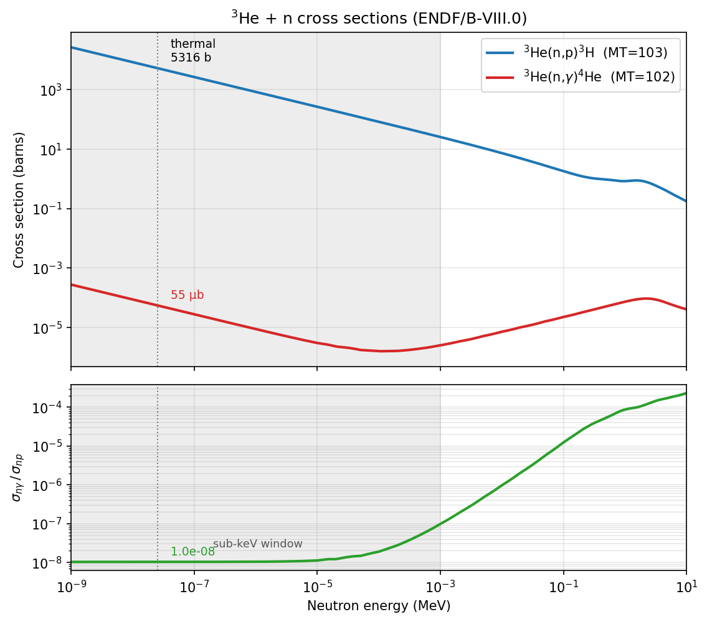

# IPC pairs vs neutron energy: does Geant4 see the γ-dark channels, and how do we get the number we want?

**For:** Dylan (+ to discuss with Alberto) · **Re:** question 2, roadmap
**Date:** 2026-06-14 · **Status:** roadmap draft

The end goal, stated plainly: **IPC `e⁺e⁻` pairs produced per pulse (per day) as
a function of neutron energy**, with *all* the channels that make ~20 MeV pairs
in ⁴He included — not just the one we currently model. This note (1) answers
whether Geant4 even sees the non-γ channels, (2) writes down the decomposition
we actually need, (3) sorts out the energy dependence and the "two E0s"
confusion, and (4) lays out a concrete roadmap with what we can do now vs what
needs external input.

---

## 1. Does Geant4 take non-gamma (IPC) de-excitation into account?

**Short answer: no — and neither does the ENDF data it runs on. Both are
photon-only for capture.** Detail, because the *why* matters:

- Geant4 neutron **radiative capture** (`particleHP`/`NeutronHPCapture`, used by
  the `FTFP_BERT_HP` list in `src/PhysicsList.cc`) de-excites the compound
  nucleus by emitting **real photons**, sampled from the evaluated
  photon-production data. The capture cross section it uses is ENDF **MT=102**,
  which is *total radiative (photon) capture*, Q = 20.578 MeV — a single lumped
  number with **no multipole decomposition and no pair channel**.
- Geant4's nuclear de-excitation (`G4PhotonEvaporation`) can emit γ rays and
  **internal-conversion electrons**, but it does **not** emit
  **internal-conversion pairs** (`e⁺e⁻`) for nuclear transitions. There is no
  nuclear internal-pair-conversion process in the standard physics.
- A 0⁺→0⁺ (E0) transition emits **no real photon at all** (a real photon can't
  carry a monopole), so it contributes nothing to MT=102, and Geant4 has no
  channel to produce the pair it *should* emit. The E0 strength is invisible to
  the neutron-data + Geant4 stack from both ends.
- One thing that *is* modelled: a real capture γ (e.g. the 20.58 MeV photon
  Geant4 emits for the photon-emitting M1/E1 strength) can **externally**
  pair-convert as it flies through the Al/gas. That is the ordinary EM γ→e⁺e⁻
  in matter — a different object from *internal* pair conversion (different
  parent, different kinematics), and it is not the X17-relevant pair.

**Bottom line:** the γ-dark E0 pairs are absent from ENDF *and* from Geant4.
This is not a setting we forgot to turn on; the physics simply isn't in the
neutron-data model.

## 2. Where do our simulation's e⁺e⁻ pairs actually come from?

Crucially, **none of our X17/IPC pairs come from Geant4's capture.** The
production runs *inject* the pair by hand: `X17PrimaryGenerator` places an
`e⁺e⁻` in the gas (X17 mode, or the E1-like IPC continuum mode), and the
branching to pairs is folded in *during analysis* as a multiplicative
coefficient (`α_IPC ≈ 2.1×10⁻³` per radiative capture in Alberto's table).

So Geant4's silence on IPC does not *bias* our pair yield — but it does mean
**whatever we do not put into the generator is simply not there.** Today the
generator has the E1-like IPC continuum and nothing for E0. The E0 pairs are
therefore missing in three places at once:

1. not in ENDF (γ-dark, absent from MT=102),
2. not in Geant4 (no IPC / no E0 channel),
3. not in our generator (only the E1 continuum).

## 3. The decomposition we actually need

Every ~20 MeV pair in ⁴He comes from a neutron that made a `⁴He*`. Split the
pair yield by *how* the `⁴He*` sheds its energy:

```
N_pairs(E_n) / pulse  =  N_beam(E_n) × [  P_radcap(E_n) · α_IPC(E*)     ← term 1: pairs as the
                                                                          IPC tail of photon-emitting
                                                                          (M1/E1) capture  (HAVE)
                                       +  P_E0cap(E_n)  · 1          ]   ← term 2: γ-dark E0 capture,
                                                                          which is ALL pairs  (MISSING)
```

- **Term 1** — `P_radcap` (radiative-capture probability per beam neutron) is
  exactly what the MeV campaign measured (714 direct `³He(n,γ)`, or
  `(n,p)t × σ_nγ/σ_np`); `α_IPC` is the QED internal-pair-conversion coefficient
  at the transition energy, ~10⁻³ and weakly multipole/energy-dependent. We
  already compute this (`mev_rates.json: ipc_per_pulse`). This is the curve we
  can produce *now*.
- **Term 2** — `P_E0cap` is the γ-dark E0 capture probability per beam neutron.
  Not in ENDF, not in Geant4, not yet estimated. **This is the open piece.**

The reason term 2 can matter despite E0 being a small *capture* channel: term 1
is suppressed by `α_IPC ~ 10⁻³`, while E0 has no γ to compete with, so its
"pair branching" is effectively 1. Term 2 can rival term 1 even when
`σ_E0 ≪ σ_M1` — specifically once `σ_E0 ≳ 10⁻³ σ_M1`. That is exactly Alberto's
"same order of magnitude as the E1 component" intuition, made quantitative.

## 4. Two different "E0 in ⁴He" — keep them straight

This tripped up the online chat too; worth nailing down before talking to the
collaboration.

- **(a) The discrete 20.21 MeV 0⁺ sub-threshold level** (Alberto's level
  diagram; the Krasznahorkay `³H(p, e⁺e⁻)⁴He` physics). In *our* `n + ³He`
  route this level sits 0.37 MeV *below* threshold, so neutrons reach it only
  through the **sub-threshold resonance tail**. It decays 0⁺→0⁺ by IPC.
- **(b) The ¹S₀ direct s-wave capture** straight to the 0⁺ ground state. Same
  selection rule (0⁺→0⁺ ⇒ E0 ⇒ γ-dark ⇒ pairs only), but it's a direct-capture
  channel, not a discrete level.

Both feed term 2 and both make ~20 MeV pairs from ⁴He. For the *rate* we want
their sum; for the *generator kinematics* they could differ (a discrete level
fixes the transition energy at 20.21 MeV; direct capture tracks the compound
energy ≈ 20.58 + ¾E_n). Worth modelling as one effective `σ_E0-pair(E_n)` with
a noted transition energy, and asking Alberto which mechanism his estimate
refers to.

## 5. Energy dependence — does E0 matter more at thermal?

- At thermal both the M1 (`³S₁→0⁺`, the 54 µb radiative number) and the E0
  (`¹S₀→0⁺`) channels are **s-wave ⇒ both ∝ 1/v**, so their *ratio is flat*
  through the thermal/epithermal region. E0 does **not** grow relative to the
  photon-emitting capture as you go colder — it just tracks it. (The E1 piece,
  by contrast, is p-wave and *turns on* toward the MeV region — the rising bump
  in the `(n,γ)` curve.)
- The sub-threshold 0⁺ tail (mechanism **a**) is nearest resonance at the
  *lowest* neutron energy (compound energy closest to 20.21 MeV at threshold)
  and recedes as E_n climbs — so if that mechanism dominates term 2, term 2 is
  relatively a low-energy effect, opposite to where term 1 lives (term 1 is 95 %
  above 100 keV). That would make E0 most relevant exactly in the sub-keV region
  we had written off — worth knowing.
- Net: we cannot say a priori whether term 2 is thermal-weighted or flat; it
  depends on the relative size of mechanisms (a) and (b), which is the nuclear
  input we are missing.

## 6. Roadmap

**Phase 0 — now, no new data (can start immediately).**
- Produce the **term-1 IPC-pairs-per-pulse (and per-day) vs E_n** curve from the
  existing campaign (`mev_rates.json`) × `α_IPC`. This is the baseline "what we
  currently claim", per decade, with the E0 term explicitly drawn as a labelled
  *gap*. (Mostly a re-plot of numbers we have.)
- **Done:** the local **(n,p) / (n,γ) / ratio** figure is regenerated from the
  ENDF file we have (`data/He3.h5` → `docs/e0_branch/figs/fig_he3_xs.png`).
  It anchors term 1 and shows the story: σ_np 1/v + the ~2 MeV bump; σ_nγ 1/v
  → minimum near 100 eV → rising toward the GDR (the p-wave E1 turning on); and
  the ratio flat at **1.0×10⁻⁸** through the whole sub-keV window, climbing 10⁴×
  to ~2×10⁻⁴ by 10 MeV. *Caveat (confirmed):* this is the **lumped MT=102** and
  cannot be sliced into E0/E1/M1 — that decomposition is not in ENDF.



**Phase 1 — the IPC coefficients (needs a tool, not new physics).**
- Get `α_IPC` for M1/E1 at ~20.58 MeV, with energy dependence, from
  **BrIccEmis** (Kibédi et al.) — the modern pair-conversion tool — rather than
  the table's flat 2.1×10⁻³; cross-check vs Schlüter & Soff (1979). Helium is
  low-Z (Born limit), so this is well-behaved.
- Get the **E0 pair energy-sharing + opening-angle distribution** at ~20 MeV
  from BrIccEmis (this is the generator input #3 from the explainer note).
- **Checked: BrIccEmis is *not* on lxplus** (not in CVMFS, not in our AFS/work
  areas). It would need installing (it's a small standalone tool from the ANU
  BrIcc suite, Kibédi et al.) or running on a machine that has it. So Phase 1 is
  blocked on getting the tool, not on data.

**Phase 2 — the E0 cross section `σ_E0-pair(E_n)` (the real unknown).**
- **⁴He R-matrix:** the ⁴He system is heavily evaluated; pull the 20.21 MeV 0⁺
  (and 21.01/21.21 MeV 0⁻) resonance parameters and compute their contribution
  in the `n+³He` channel near threshold (Hale's ⁴He R-matrix; or AZURE2 with
  the evaluated levels). This sets mechanism (a).
- **Wervelman et al., NPA 526 (1991) 265** — measured M1/E1 content of
  `³He(n,γ)⁴He`; anchors term 1 and constrains the s-wave structure.
- Theory estimate of the ¹S₀ monopole capture strength for mechanism (b).
- Output: a number/curve for `σ_E0-pair(E_n)`, even if only an order-of-
  magnitude bracket — enough to decide whether term 2 is negligible or not.

**Phase 3 — simulation, if Phase 2 says it's non-negligible.**
- Add an **E0 generator component** to `X17PrimaryGenerator` (transition energy
  per §4, E0 pair kinematics from Phase 1), weighted by
  `σ_E0-pair / σ_radcap`, mixed alongside the existing IPC continuum.
- Re-run the IPC event pool and push through the existing acceptance machinery
  → **IPC pairs/pulse/day vs E_n, now with E0 included**, and the change to the
  opening-angle background shape under the X17 window.

**What blocks what:** Phase 0 is unblocked and local. Phase 1 needs BrIccEmis
(lxplus?). Phase 2 needs nuclear-structure input/literature (the rate-limiter).
Phase 3 needs Phase 1+2 and an lxplus run (Geant4 is not local — see
`memory/env_build_run`).

---

### First decisions to make
1. Is Phase 0 (term-1 curve + cross-section plot + E0-as-a-gap) the right thing
   to hand Alberto next, to frame the question quantitatively?
2. BrIccEmis is not on lxplus — do we install it (small ANU tool) or is there a
   machine that already has it? That gate is what unblocks Phase 1.
3. Who owns the nuclear input for Phase 2 — do we ask Alberto / the theory
   contact for `σ_E0`, or pull the ⁴He R-matrix ourselves?
