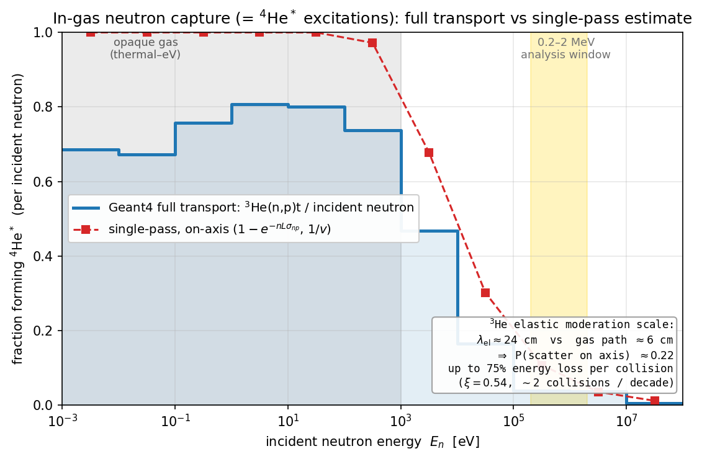
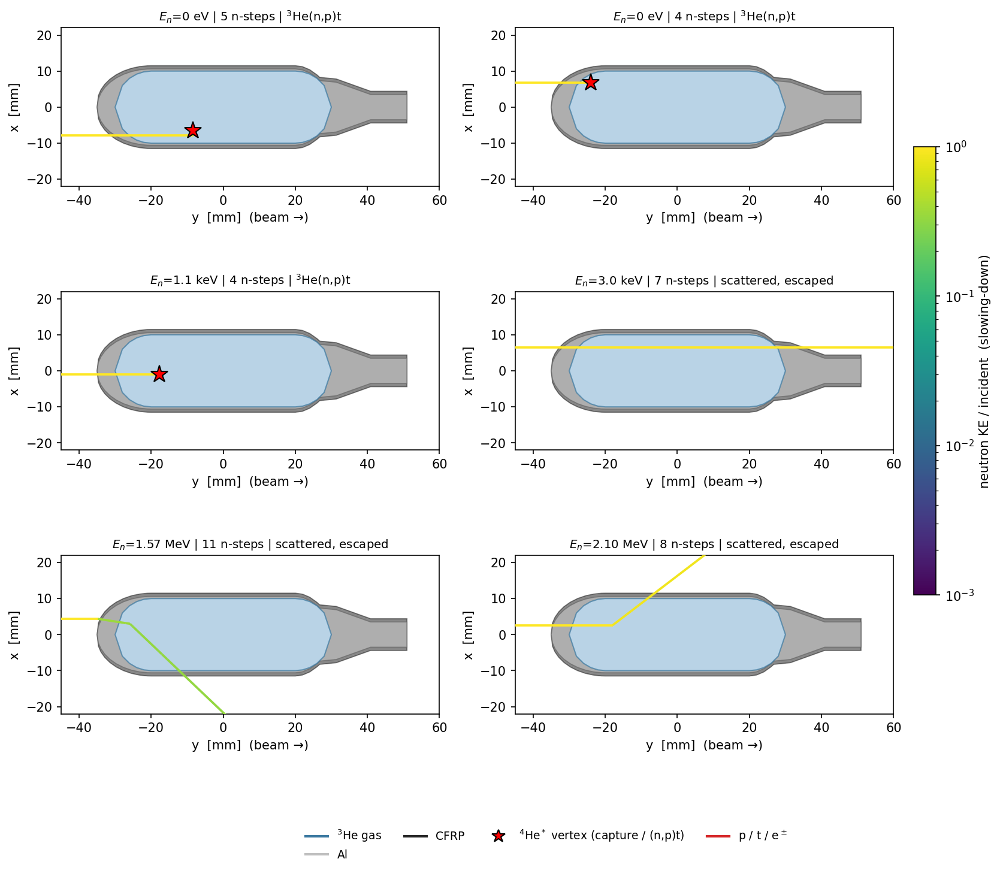

# Neutron histories in the gas cell: are scattering, slowing-down and capture included?

**For:** Alberto · **Re:** question 1 (neutron transport in the He-3 cell)
**Date:** 2026-06-14 · **Status:** draft for internal circulation

---

## The question

> *Are the simulations taking into account the neutron histories (scattering,
> absorption, capture) within the gas-cell? The slowing down of neutron energy
> inside He-3 is particularly efficient and could enhance the gamma/IPC
> production, no?*

Short answer: **yes, fully — and at the high-precision (data-driven) level.**
The efficient in-gas moderation you point to is a real physical effect and it
is present in the simulation. In *this* geometry its integrated impact on the
excitation rate turns out to be a modest perturbation rather than a large
boost, for a simple reason: the gas column is optically thin to elastic
scattering above ~10 keV, so most fast neutrons make a single pass. The point
worth stressing is that **whatever its size, the effect is already inside the
numbers** — we do not approximate it away.

---

## 1. What the simulation actually transports

Neutrons are not generated as a "capture probability". They are launched as
real particles from the evaluated n_TOF EAR2 flux (energy **and**
energy-dependent transverse profile) upstream of the vessel, and tracked
step-by-step through the STEP-derived capsule and the full detector until they
are absorbed or leave the world. The relevant physics is:

| Process | Geant4 component | Note |
|---|---|---|
| Elastic scattering (the slowing-down) | `G4HadronElasticPhysicsHP` | high-precision G4NDL data < 20 MeV |
| Inelastic / `³He(n,p)t` | `G4HadronPhysicsFTFP_BERT_HP` | (n,p)t is filed under `neutronInelastic` |
| Radiative capture `³He(n,γ)⁴He` | NeutronHP | the X17/IPC parent channel |
| Thermalisation transport | **no `G4NeutronTrackingCut`** | see below |

Two deliberate choices matter for your question:

- **High-precision (HP) data are on.** Elastic scattering, the (n,p)t channel
  and radiative capture all run on evaluated cross-section data with
  resonances and the correct energy dependence — not on a parametric model.
  Self-shielding, multiple scattering and in-gas moderation are therefore
  *automatic*, not assumed. (`src/PhysicsList.cc:33-37`)
- **The neutron tracking cut is removed on purpose.** Its default 10 µs time
  limit would silently kill slow neutrons mid-flight (a 0.4 eV neutron needs
  ~20 µs to cross 20 cm), which would destroy exactly the thermal/epithermal
  transport this experiment lives on. We let HP track neutrons all the way to
  thermalisation. (`src/PhysicsList.cc:48-52`)

The terminal interaction of every primary neutron — volume, position and the
process that stopped it — is recorded (`src/SteppingAction.cc:45-66`), which is
what lets us count excitations directly (next section).

The cell the neutrons see is the real one: pure ³He at 62.7 mg/cm³ (500 bar)
in the STEP-profile Al vessel with the 0.9 mm CFRP wrap
(`src/DetectorConstruction.cc:113-122, 297-342`).

## 2. How many excitations? (the "are we undercounting" check)

Every `³He + n → ⁴He*` event — whichever way the ⁴He\* then decays — is one
excitation. Since ⁴He\* de-excites overwhelmingly through (n,p)t (the γ/IPC/X17
branch is ~10⁻⁸–10⁻⁴ of captures), **the number of excitations is, to a part in
10⁴, just the number of `³He(n,p)t` events** — and that channel has enormous
statistics, so we can read the excitation rate straight off the simulation
without any branching-ratio extrapolation.

From the 5×10⁸-neutron full-range run (`analysis/mev/mev_rates.json`), the
fraction of incident beam neutrons that form ⁴He\* per energy decade is:

The answer genuinely differs by energy regime — but the scattering and
slowing-down are switched on identically in all three; what changes is how much
they matter:

| Regime | Gas to (n,p)t | What dominates the history | Role of scattering |
|---|---|---|---|
| **thermal → ~keV** | opaque (τ_axis ≫ 1) | absorbed within ~a fraction of a mm of entry | self-shielding — captures pile up at the upstream gas surface (see `analyze_thermal_captures.py` depth plot) |
| **~10 keV → ~1 MeV** | transition (τ_axis ~ 1 → 0.04) | mostly single pass; a minority scatter once and slow | the moderation channel is "live" here and fully tracked, but perturbative (§3) |
| **> few MeV** | thin (τ_axis < 0.04) | nearly all pass straight through | rare large-angle/large-ΔE elastic kicks give a few neutrons a second chance |

Reading the figure against that:

- **Thermal → ~keV (grey band): opaque gas.** 67–81 % of beam neutrons that
  reach the bore are absorbed. The plateau sits *below* 100 % only because the
  beam is wider than the 2 cm bore (and is wider still at low energy, where the
  EAR2 profile broadens) — a geometry effect the simulation gets for free and a
  thin-target formula does not.
- **~10 keV → MeV: the gas turns thin.** The (n,p)t fraction falls from ~0.5 to
  ~0.04. This is the regime that carries the physics case (0.2–2 MeV window,
  gold band): 95 % of the 714 *directly observed* radiative captures sit above
  100 keV (`mev_rates.json`).
- **Full transport vs single pass (red dashed).** The naive single-pass,
  on-axis estimate `1 − exp(−nLσ_np)` with `1/v` tracks the full-transport
  curve but sits *above* it at every decade (ratio 0.5–0.8). The deficit is
  not a missing enhancement — it is the beam-averaged chord being shorter than
  the 6 cm on-axis path because most of the beam is off-axis. In other words,
  the full sim, with all the scattering included, lands *at or slightly below*
  the simplest hand estimate, so **we are not silently undercounting captures**;
  if anything a careless on-axis thin-target number would over-count them.

## 3. Scoping the moderation mechanism you raised

Your physical intuition is exactly right at the *per-collision* level: ³He is a
light nucleus, so a single elastic n–³He collision can remove up to
**75 %** of the neutron energy (`f_max = 1 − ((A−1)/(A+1))² = 0.75`), with mean
log-energy decrement ξ = 0.54 → only ~2 collisions to drop a decade in energy.
Per scatter, ³He is about as efficient a moderator as exists.

What limits the *integrated* effect here is geometry, not efficiency:

- Elastic mean free path in the gas: `λ_el = 1/(nσ_el) ≈ 24 cm`
  (σ_el ≈ 3.3 b), versus a ~6 cm on-axis gas path.
- ⇒ only ~**22 %** of fast neutrons scatter even once inside the gas on axis,
  fewer off axis.

So at MeV energies roughly a fifth of neutrons get a single large energy kick
toward the higher-σ_np region and a "second chance" to capture; the rest pass
straight through. That is a real, positive contribution to the capture rate —
and it is fully inside the Geant4 numbers above — but in a 2 cm-bore, thin gas
column it perturbs the excitation count at the tens-of-percent level rather
than dominating it. (In a larger or denser cell the same physics would matter
much more; the conclusion is geometry-specific, not generic.)

## 4. The histories, made visual

To show the three regimes directly, the simulation now dumps full per-step
neutron trajectories (`--trajdump`); the displays below are real Geant4
histories at thermal, ~keV and ~MeV, drawn over the actual capsule
cross-section (beam → +y), each neutron coloured by the **fraction of its
incident energy still remaining**, so the slowing-down is visible as a
colour change along the path. Red stars mark ⁴He\* formation (here the
dominant ³He(n,p)t — the rare radiative/IPC sub-branch rides on the same
captures).

What the panels show, regime by regime — and note the scattering physics is
identical in every one:

- **Thermal (top):** the neutron is absorbed within a fraction of a mm of the
  upstream gas surface — the star sits right at the entry edge. This is
  self-shielding in a single picture: at 25 meV the gas is so opaque that the
  interior is never sampled.
- **keV (middle):** the gas is semi-transparent — the neutron traverses a
  good fraction of the bore before (n,p)t, and a sibling event simply scatters
  and leaves. Captures now populate the volume rather than the surface.
- **MeV (bottom):** the gas is thin, so most neutrons cross it, but the
  elastic histories are now rich — the path kinks at each n–³He collision and
  the colour drops from yellow toward green as a single scatter sheds a large
  chunk of energy (the 75 % per-collision moderation of §3, caught live). Most
  escape; the minority that slow down get the "second chance" to capture.

These are exactly the pass-through / scatter-then-leave / capture-at-depth
histories the decade budget (§2) sums over — the displays just make the
mechanism legible. (Build/run/plot recipe: `event_display_RUN.md`;
trajectory dump `--trajdump` in `SteppingAction::DumpTrajectoryStep`, plotter
`scripts/make_neutron_event_display.py`.)

A higher-statistics **E-at-capture vs E-incident** scatter (how much
slowing-down precedes each excitation) is the natural quantitative companion
and would come from the full neutron campaign's terminal data on EOS; noted as
a follow-up.

---

### One-paragraph answer for the email

Yes — neutron scattering, slowing-down and capture in the gas cell are fully
simulated with high-precision (G4NDL/HP) data and no neutron tracking cut, so
the efficient in-gas moderation you mention is included automatically. Counting
excitations directly through the ³He(n,p)t channel (which is, to a part in 10⁴,
the total ⁴He\* production), the full-transport rate per energy decade sits at
or just below a naive single-pass estimate, so we are not undercounting. The
moderation mechanism is real — a single n–³He elastic collision can shed up to
75 % of the energy — but the gas column is optically thin to elastic scattering
above ~10 keV (MFP ≈ 24 cm vs a 6 cm path), so only ~20 % of fast neutrons
scatter in the gas and the integrated boost to the capture rate is a
tens-of-percent perturbation, all of it already inside the simulated numbers.
The attached event displays show the three regimes — thermal capture at the
gas surface (self-shielding), keV capture through the volume, and MeV neutrons
scattering and slowing inside the gas — all with the same scattering physics
switched on.
